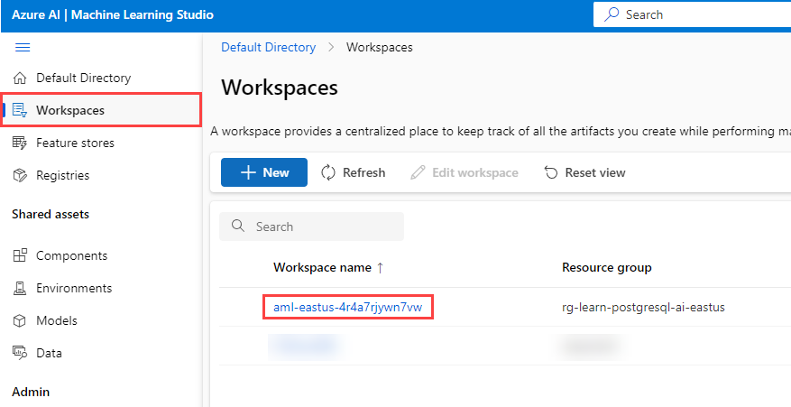
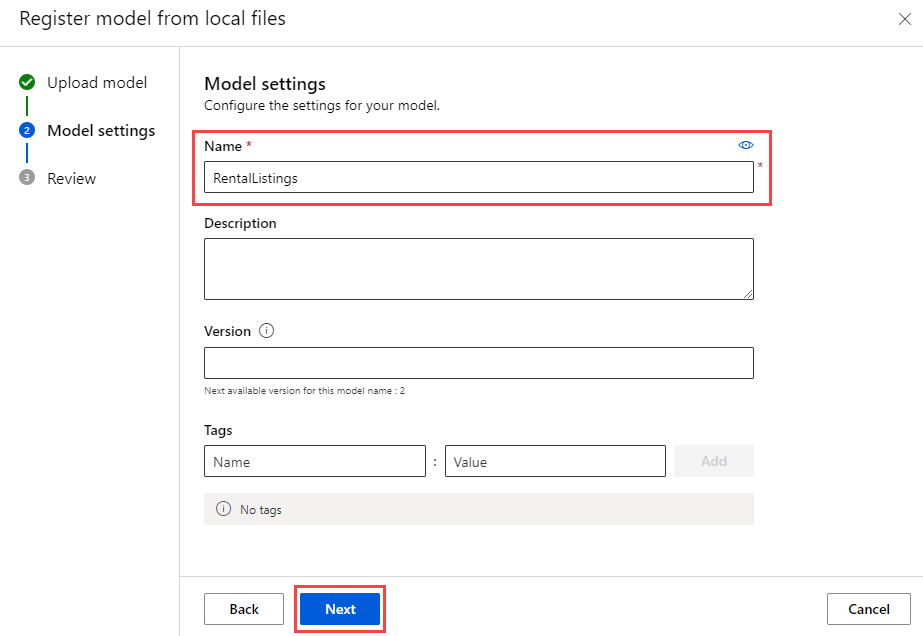
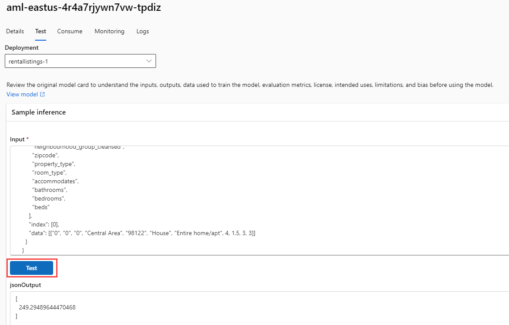

[翻訳元](https://microsoftlearning.github.io/mslearn-postgresql/Instructions/Labs/19-perform-inference-azure-machine-learning.html)

# Azure Machine Learning を使って推論を実行する

Margie's Travel(MT)のリード開発者として、短期賃貸の夜間レンタル価格を見積もる機能の開発を依頼されました。いくつかの履歴データをテキスト ファイルとして収集し、これを使用して Azure Machine Learning で単純な回帰モデルをトレーニングしたいと考えています。次に、Azure Database for PostgreSQL Flexible Server データベースでホストされているデータに対してそのモデルを使用します。

この演習では、Azure Machine Learning の自動機械学習機能を使用して作成されたモデルをデプロイします。次に、その配置済みモデルを使用して、短期賃貸物件の夜間販売価格を見積もります。

## はじめに

管理者権限を持つ [Azure サブスクリプション](https://azure.microsoft.com/free)が必要であり、そのサブスクリプションで Azure OpenAI にアクセスすることが承認されている必要があります。Azure OpenAI へのアクセスが必要な場合は、[Azure OpenAI の制限付きアクセス](https://learn.microsoft.com/legal/cognitive-services/openai/limited-access)ページで申請してください。

### リソースを Azure サブスクリプションにデプロイする

この手順では、Azure Cloud Shell から Azure CLI コマンドを使用してリソース グループを作成し、Bicep スクリプトを実行して、この演習を完了するために必要な Azure サービスを Azure サブスクリプションにデプロイする方法について説明します。

> [!NOTE]
> このラーニングパスで複数のモジュールを実行している場合は、モジュール間で Azure 環境を共有できます。その場合は、このリソースのデプロイ手順を1回だけ完了する必要があります。

1. Web ブラウザーを開き、[Azure portal](https://portal.azure.com/) に移動します。

2. Azure portal ツールバーの \[**Cloud Shell**\] アイコンを選択して、ブラウザー ウィンドウの下部にある新しい [Cloud Shell](https://learn.microsoft.com/azure/cloud-shell/overview) ウィンドウを開きます。


3. Cloud Shell プロンプトで、次のように入力して、演習用のリソースを含む GitHub リポジトリを複製します:

```bash
git clone https://github.com/MicrosoftLearning/mslearn-postgresql.git
```

4. 次に、3つのコマンドを実行して変数を定義し、Azure CLI コマンドを使用して Azure リソースを作成する際の冗長な入力を減らします。変数は、リソースグループに割り当てる名前 (`RG_NAME`)、リソースがデプロイされる Azure リージョン (`REGION`)、PostgreSQL 管理者ログイン用にランダムに生成されたパスワード (`ADMIN_PASSWORD`) を表します。

最初のコマンドでは、対応する変数に割り当てられた領域は `eastus` ですが、好みの場所に置き換えることもできます。ただし、既定値を置き換える場合は、[抽象的な概要作成をサポートする別の Azure リージョン](https://learn.microsoft.com/azure/ai-services/language-service/summarization/region-support)を選択して、このラーニングパスのモジュールのすべてのタスクを完了できるようにする必要があります。

```bash
REGION=eastus
```

次のコマンドは、この演習で使用するすべてのリソースを格納するリソースグループに使用する名前を割り当てます。対応する変数に割り当てられるリソースグループ名は `rg-learn-postgresql-ai-$REGION` で`REGION` は上記で指定した場所です。ただし、好みに合った他のリソースグループ名に変更できます。

```bash
RG_NAME=rg-learn-postgresql-ai-$REGION
```

最後のコマンドは、PostgreSQL 管理者ログインのパスワードをランダムに生成します。後で PostgreSQL Flexible Server に接続するときに使用するために、安全な場所にコピーします。

```bash
a=()
for i in {a..z} {A..Z} {0..9}; 
    do
    a[$RANDOM]=$i
done
ADMIN_PASSWORD=$(IFS=; echo "${a[*]::18}")
echo "Your randomly generated PostgreSQL admin user's password is:"
echo $ADMIN_PASSWORD
```

5. 複数の Azure サブスクリプションにアクセスでき、既定のサブスクリプションが、この演習のリソースグループやその他のリソースを作成するサブスクリプションではない場合は、次のコマンドを実行して適切なサブスクリプションを設定し、`<subscriptionName|subscriptionId>` トークンを使用するサブスクリプションの名前または ID に置き換えます:

```bash
az account set --subscription <subscriptionName|subscriptionId>
```

6. 次の Azure CLI コマンドを実行して、リソースグループを作成します:

```bash
az group create --name $RG_NAME --location $REGION
```

7. 最後に、Azure CLI を使用して Bicep デプロイスクリプトを実行し、リソースグループに Azure リソースをプロビジョニングします:

```bash
az deployment group create --resource-group $RG_NAME --template-file "mslearn-postgresql/Allfiles/Labs/Shared/deploy.bicep" --parameters restore=false adminLogin=pgAdmin adminLoginPassword=$ADMIN_PASSWORD
```

Bicep デプロイ スクリプトは、この演習を完了するために必要な Azure サービスをリソースグループにプロビジョニングします。デプロイされるリソースには、Azure Database for PostgreSQL Flexible Server、Azure OpenAI、Azure AI Language サービスが含まれます。また、Bicep スクリプトでは、PostgreSQL サーバーの許可リストへの `azure_ai` 拡張機能と `vector` 拡張機能の追加 (azure.extensions サーバーパラメーターを使用)、サーバー上に `rentals` という名前のデータベースを作成し、`text-embedding-ada-002` モデルを使用する `embedding` という名前のデプロイを Azure OpenAI サービスに追加するなど、いくつかの構成手順も実行されます。Bicep ファイルは、このラーニングパスのすべてのモジュールで共有されるため、一部の演習ではデプロイされたリソースの一部のみを使用できます。

通常、デプロイが完了するまでに数分かかります。Cloud Shell から監視するか、上記で作成したリソースグループの \[**デプロイ**\] ページに移動して、そこでデプロイの進行状況を確認できます。

Bicep デプロイスクリプトの実行時にいくつかのエラーが発生する場合があります。最も一般的なメッセージとその解決手順は次のとおりです:

* Azure AI Services リソースを以前に作成していない場合は、責任ある AI の利用条件が演習で用いるサブスクリプションで未読で同意されていないというメッセージが表示されることがあります:

```
{"code": "ResourceKindRequireAcceptTerms",
"message": "This subscription cannot create TextAnalytics until you agree to Responsible AI terms for this resource.
You can agree to Responsible AI terms by creating a resource through the Azure Portal and trying again."}
```

このエラーを解決するには、Azure portal から最初の言語リソースを作成し、使用条件を確認して承認できるようにする必要があります。ここで行うことができます: [https://portal.azure.com/#create/Microsoft.CognitiveServicesTextAnalytics](https://portal.azure.com/#create/Microsoft.CognitiveServicesTextAnalytics). ランダムで有効な名前を持つ新しいリソースグループの下に作成し、デプロイする Language サービスにランダムで有効な名前を割り当てます。その後、サブスクリプション全体の責任ある AI の条項に同意すると、同じ Azure サブスクリプションで任意のデプロイツール (SDK、CLI、ARM テンプレートなど) を使用して、後続の言語リソースを作成できます。そのため、ポータルで最初のリソースを作成したら、それを削除し、コマンドを再実行して Bicep デプロイスクリプトを実行できます。

* このラーニングパスの Bicep デプロイ スクリプトを以前に実行し、その後リソースを削除した場合、リソースを削除してから 48 時間以内にスクリプトを再実行しようとすると、次のようなエラー メッセージが表示されることがあります:

```
{"code": "InvalidTemplateDeployment",
"message": "The template deployment 'deploy' is not valid according to the validation procedure.
The tracking id is '4e87a33d-a0ac-4aec-88d8-177b04c1d752'. See inner errors for details."}

Inner Errors:
{"code": "FlagMustBeSetForRestore",
"message": "An existing resource with ID
'/subscriptions/{subscriptionId}/resourceGroups/rg-learn-postgresql-ai-eastus/providers/Microsoft.CognitiveServices/accounts/{accountName}'
has been soft-deleted.
To restore the resource, you must specify 'restore' to be 'true' in the property.
If you don't want to restore existing resource, please purge it first."}
```

このメッセージが表示された場合は、上記の `azure deployment group create` コマンドを変更して、`restore` パラメーターを `true` に設定して再実行します。

* 選択したリージョンで特定のリソースのプロビジョニングが制限されている場合は、`REGION` 変数を別の場所に設定し、Bicep デプロイ スクリプトを再実行する必要があります。

```
{"status":"Failed",
"error":{"code":"DeploymentFailed",
"target":"/subscriptions/{subscriptionId}/resourceGroups/{resourceGrouName}/providers/Microsoft.Resources/deployments/{deploymentName}",
"message":"At least one resource deployment operation failed.
Please list deployment operations for details.
Please see https://aka.ms/arm-deployment-operations for usage details.",
"details":[{"code":"ResourceDeploymentFailure",
"target":"/subscriptions/{subscriptionId}/resourceGroups/{resourceGrouName}/providers/Microsoft.DBforPostgreSQL/flexibleServers/{serverName}",
"message":"The resource write operation failed to complete successfully, because it reached terminal provisioning state 'Failed'.",
"details":[{"code":"RegionIsOfferRestricted",
"message":"Subscriptions are restricted from provisioning in this region.
Please choose a different region.
For exceptions to this rule please open a support request with Issue type of 'Service and subscription limits'.
See https://review.learn.microsoft.com/en-us/azure/postgresql/flexible-server/how-to-request-quota-increase for more details."}]}]}}
```

8. リソースのデプロイが完了したら、Cloud Shell ウィンドウを閉じます。

## Azure Machine Learing モデルをデプロイする

最初の手順では、Azure Machine Learning にモデルを配置します。リポジトリには、PostgreSQL 統合で使用する一連のリストデータでトレーニングされたモデルの例が含まれています。

1. [mslearn-postgresql リポジトリ](https://microsoftlearning.github.io/mslearn-postgresql/Allfiles/Labs/Shared/mlflow-model.zip)から `mlflow-model.zip` ファイルをダウンロードします。このフォルダから **mlflow-model** というフォルダにファイルを抽出します。

2. [Azure portal](https://portal.azure.com/) で、新しく作成した Azure Machine Learning ワークスペースに移動します。

3. [**スタジオの起動**] ボタンを選択して、Azure Machine Learning Studio を開きます。


4. [**ワークスペース**] メニュー オプションを選択し、新しく作成した Azure Machine Learning ワークスペースを選択します。



5. [**アセットメニュ**]ーから[**モデル**]メニューオプションを選択します。次に、[**+ 登録**] メニュー オプションを選択し、[**ローカル ファイルから**] を選択します。


6. [**モデルのアップロード**] メニューで、モデルの種類を [**MLflow**] に設定します。次に、[**参照**] を選択し、**mlflow-model** フォルダに移動してアセットをアップロードします。その後、[**次へ**]ボタンを選択して続行します。


7. モデルに **RentalListings** という名前を付け、[**次へ**] ボタンを選択します。



8. [**登録**] ボタンを選択して、モデルの登録を完了します。この操作により、[**モデル**] ページに戻ります。新しく作成したモデルを選択します。

> [!NOTE]
> モデルが表示されない場合は、[**更新**] メニュー オプション ボタンを選択してページを再読み込みします。その後、**RentalListingings** モデルが表示されます。

9. [**デプロイ**] ボタン オプションを選択し、新しい**リアルタイム エンドポイント**を作成します。


10. デプロイ ポップアップ メニューで、 [**仮想マシン**] を **Standard_DS2_v2** などに設定し、 [**インスタンス数**] を 1 に設定します。[**デプロイ**] ボタンを選択します。デプロイ プロセスには仮想マシンのプロビジョニングと Docker コンテナーとしてのモデルのデプロイが含まれるため、デプロイが完了するまでに数分かかる場合があります。


11. エンドポイントがデプロイされたら、 [**Consume**] タブに移動し、REST エンドポイントと主キーをコピーして、次のセクションで使用できるようにします。


12. エンドポイントが正しく実行されていることをテストするには、エンドポイントの [**テスト**] タブを使用します。次に、下のコードブロックを貼り付けて、既存のコードを置き換えます。[**テスト**] ボタンを選択すると、この特定の物件が 1 泊のレンタルで獲得できると予想される米ドル数を示す 1 つの 10 進数値を含む配列を含む JSON 出力が表示されます。

```json
{
    "input_data": {
        "columns": [
            "host_is_superhost",
            "host_has_profile_pic",
            "host_identity_verified",
            "neighbourhood_group_cleansed",
            "zipcode",
            "property_type",
            "room_type",
            "accommodates",
            "bathrooms",
            "bedrooms",
            "beds"
        ],
        "index": [0],
        "data": [["0", "0", "0", "Central Area", "98122", "House", "Entire home/apt", 4, 1.5, 3, 3]]
    }
}
```



## Azure Cloud Shell で psql を使用してデータベースに接続する

このタスクでは、[Azure Cloud Shell](https://learn.microsoft.com/azure/cloud-shell/overview) から [psql コマンドラインユーティリティ](https://www.postgresql.org/docs/current/app-psql.html)を使用して、Azure Database for PostgreSQL Flexible Server 上の `rentals` データベースに接続します。

1. [Azure portal](https://portal.azure.com/) で、新しく作成した Azure Database for PostgreSQL Flexible Server に移動します。

2. リソースメニューの \[**設定**\] で \[**データベース**\] を選択し、`rentals` データベースの \[**接続**\] を選択します。


3. Cloud Shell の \[Password for user pgAdmin\] プロンプトで、**pgAdmin** ログイン用にランダムに生成されたパスワードを入力します  。
ログインすると、`rentals` データベースの `psql` プロンプトが表示されます。

4. この演習の残りの部分では、Cloud Shell で作業を続けるため、ウィンドウの右上にある \[**最大化**\] ボタンを選択して、ブラウザー ウィンドウ内のウィンドウを展開すると便利な場合があります。


## azure_ai 拡張機能のインストールと構成 

`azure_ai` 拡張機能を使用する前に、拡張機能をデータベースにインストールし、Azure AI Services リソースに接続するように構成する必要があります。`azure_ai` 拡張機能を使用すると、Azure OpenAI と Azure AI Language サービスをデータベースに統合できます。データベースで拡張機能を有効にするには、次の手順を実行します:

1. `psql` プロンプトで次のコマンドを実行して、環境の設定時に実行した Bicep デプロイスクリプトによって、`azure_ai` 拡張機能と `vector` 拡張機能がサーバーの許可リストに正常に追加されたことを確認します:

```sql
SHOW azure.extensions;
```

このコマンドは、サーバーの許可リストにある拡張機能のリストを表示します。すべてが正しくインストールされた場合、出力には次のように `azure_ai` と `vector` が含まれている必要があります:

```sql
  azure.extensions 
 ------------------
  azure_ai,vector
```

拡張機能を Azure Database for PostgreSQL Flexible Serverデータベースにインストールして使用する前に、「[PostgreSQL 拡張機能の使用方法](https://learn.microsoft.com/azure/postgresql/flexible-server/concepts-extensions#how-to-use-postgresql-extensions)」の説明に従って、サーバーの許可リストに追加する必要があります。

2. これで、[CREATE EXTENSION](https://www.postgresql.org/docs/current/sql-createextension.html) コマンドを使用して `azure_ai` 拡張機能をインストールする準備が整いました。

```sql
CREATE EXTENSION IF NOT EXISTS azure_ai;
```

`CREATE EXTENSION` は、スクリプトファイルを実行して、新しい拡張機能をデータベースにロードします。このスクリプトは、通常、関数、データ型、スキーマなどの新しい SQL オブジェクトを作成します。同じ名前の拡張機能が既に存在する場合は、エラーがスローされます。`IF NOT EXISTS` を追加すると、コマンドが既にインストールされている場合にエラーをスローせずに実行できます。

3. 次に、`azure_ai.set_setting()` 関数を使用して、デプロイされた Azure Machine Learning エンドポイントへの接続を構成する必要があります。デプロイされたエンドポイントとそのキーを指すように `azure_ml` 設定を構成します。`azure_ml.scoring_endpoint` の値は、エンドポイントの REST URL になります。`azure_ml.endpoint_key` の値は、Key 1 または Key 2 の値になります。

```sql
SELECT azure_ai.set_setting('azure_ml.scoring_endpoint','https://<YOUR_ENDPOINT>.<YOUR_REGION>.inference.ml.azure.com/score');
```

```sql
SELECT azure_ai.set_setting('azure_ml.endpoint_key', '<YOUR_KEY>');
```

## 価格を設定するリストを含むテーブルを作成する

価格を設定したい短期賃貸物件を保存するには、1つのテーブルが必要です。

1. `rentals` データベースで次のコマンドを実行して、新しい `listings_to_price` テーブルを作成します。

```sql
CREATE TABLE listings_to_price (
  id INT GENERATED BY DEFAULT AS IDENTITY PRIMARY KEY,
  host_is_superhost INT NOT NULL,
  host_has_profile_pic INT NOT NULL,
  host_identity_verified INT NOT NULL,
  neighbourhood_group_cleansed VARCHAR(75) NOT NULL,
  zipcode VARCHAR(5) NOT NULL,
  property_type VARCHAR(30) NOT NULL,
  room_type VARCHAR(30) NOT NULL,
  accommodates INT NOT NULL,
  bathrooms DECIMAL(3,1) NOT NULL,
  bedrooms INT NOT NULL,
  beds INT NOT NULL
);
```

2. 次に、`rentals` データベースで次のコマンドを実行して、新しいレンタル リスト データを挿入します。

```sql
INSERT INTO listings_to_price(host_is_superhost, host_has_profile_pic, host_identity_verified,
  neighbourhood_group_cleansed, zipcode, property_type, room_type,
  accommodates, bathrooms, bedrooms, beds)
VALUES
  (1, 1, 1, 'Queen Anne', '98119', 'House', 'Private room', 2, 1.0, 1, 1),
  (0, 1, 1, 'University District', '98105', 'Apartment', 'Entire home/apt', 4, 1.5, 2, 2),
  (0, 0, 0, 'Central Area', '98122', 'House', 'Entire home/apt', 4, 1.5, 3, 3),
  (0, 0, 0, 'Downtown', '98101', 'House', 'Entire home/apt', 4, 1.5, 3, 3),
  (0, 0, 0, 'Capitol Hill', '98122', 'House', 'Entire home/apt', 4, 1.5, 3, 3);
```

このコマンドは、5行の新しいリストデータを挿入します。

## リストデータに価格を追加する関数を作成する

リストデータに価格を追加する、ストアドプロシージャを作成します。

1. `psql` プロンプトで次のコマンドを実行して、`price_listing` という名前の新しい関数を作成します。

```sql
CREATE OR REPLACE FUNCTION price_listing (
  IN host_is_superhost INT, IN host_has_profile_pic INT, IN host_identity_verified INT,
  IN neighbourhood_group_cleansed VARCHAR(75), IN zipcode VARCHAR(5), IN property_type VARCHAR(30),
  IN room_type VARCHAR(30), IN accommodates INT, IN bathrooms DECIMAL(3,1), IN bedrooms INT, IN beds INT)
RETURNS DECIMAL(6,2)
AS $$
  SELECT CAST(jsonb_array_elements(inference.inference) AS DECIMAL(6,2)) AS expected_price
  FROM azure_ml.inference(('
  {
    "input_data": {
      "columns": [
        "host_is_superhost",
        "host_has_profile_pic",
        "host_identity_verified",
        "neighbourhood_group_cleansed",
        "zipcode",
        "property_type",
        "room_type",
        "accommodates",
        "bathrooms",
        "bedrooms",
        "beds"
      ],
      "index": [0],
      "data": [["' || host_is_superhost || '", "' || host_has_profile_pic || '", "' || host_identity_verified || '", "' ||
      neighbourhood_group_cleansed || '", "' || zipcode || '", "' || property_type || '", "' || room_type || '", ' ||
      accommodates || ', ' || bathrooms || ', ' || bedrooms || ', ' || beds || ']]
    }
  }')::jsonb, deployment_name=>'rentallistings-1');
$$ LANGUAGE sql;
```

> [!NOTE]
> デフォルトでは、デプロイ名はモデル名 (**rentallistings**) とバージョン番号 (**1**) の組み合わせです。新しいバージョンのモデルをデプロイし、既定のデプロイ名を使用する場合、新しいデプロイ名は **rentallistings-2** になります。

2. 次の SQL コマンドを使用して関数を実行します:

```sql
SELECT * FROM price_listing(0, 0, 0, 'Central Area', '98122', 'House', 'Entire home/apt', 4, 1.5, 3, 3);
```

このクエリは、10 進数形式で夜間のレンタル価格の見積もりを返します。

3. 次の SQL コマンドを使用して、`listings_to_price` テーブルの各行に対して関数を呼び出します:

```sql
SELECT l2p.*, expected_price
FROM listings_to_price l2p
  CROSS JOIN LATERAL price_listing(l2p.host_is_superhost, l2p.host_has_profile_pic, l2p.host_identity_verified,
    l2p.neighbourhood_group_cleansed, l2p.zipcode, l2p.property_type, l2p.room_type,
    l2p.accommodates, l2p.bathrooms, l2p.bedrooms, l2p.beds) expected_price;
```

このクエリは、`listings_to_price` の各行に 1 つずつ、合計 5 つの行を返します。`listings_to_price` テーブルのすべての列と、`price_listing()` 関数の結果が `expected_price` として含まれます。

## クリーンアップ

この演習を完了したら、作成した Azure リソースを削除します。データベースの使用量ではなく、構成された容量に対して課金されます。次の手順に従って、リソース グループと、このラボ用に作成したすべてのリソースを削除します。
> [!NOTE]
> このラーニング パスで追加のモジュールを完了する予定がある場合は、完了する予定のすべてのモジュールを完了するまで、このタスクをスキップできます。

1. Web ブラウザーを開いて [Azure portal](https://portal.azure.com/) に移動し、ホームページで Azure サービスの\[**リソースグループ**\]を選択します。


2. 任意のフィールドの検索ボックスに、このラボ用に作成したリソースグループの名前を入力し、一覧からリソースグループを選択します。

3. リソースグループの\[**概要**\]ページで、\[**リソース グループの削除**\]を選択します。


4. 確認ダイアログで、削除するリソース グループ名を入力して確認し、\[**削除**\]を選択します。
