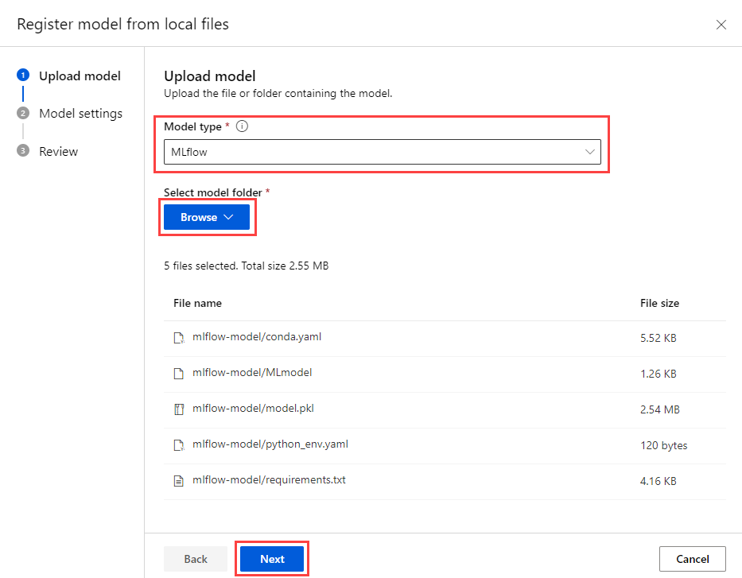

# Azure AI 拡張機能を調べる

Margie's Travel の主任開発者であるあなたは、賃貸物件に関するインテリジェントなレコメンデーションを顧客に提供する AI を活用したアプリケーションを構築する任務を負っています。Azure Database for PostgreSQL の `azure_ai` 拡張機能の詳細と、ジェネレーティブ AI (GenAI) の機能をアプリに統合するのにどのように役立つかについて学習する必要があります。この演習では、`azure_ai` 拡張機能を Azure Database for PostgreSQL Flexible Server にインストールし、Azure AI サービスと ML サービスを統合するための機能を調べることで、拡張機能とその機能を調べます。

## はじめに

管理者権限を持つ [Azure サブスクリプション](https://azure.microsoft.com/free)が必要であり、そのサブスクリプションで Azure OpenAI にアクセスすることが承認されている必要があります。Azure OpenAI へのアクセスが必要な場合は、[Azure OpenAI の制限付きアクセス](https://learn.microsoft.com/legal/cognitive-services/openai/limited-access)ページで申請してください。

### リソースを Azure サブスクリプションにデプロイする

この手順では、Azure Cloud Shell から Azure CLI コマンドを使用してリソース グループを作成し、Bicep スクリプトを実行して、この演習を完了するために必要な Azure サービスを Azure サブスクリプションにデプロイする方法について説明します。

1. Web ブラウザーを開き、[Azure portal](https://portal.azure.com/) に移動します。

2. Azure portal ツールバーの \[**Cloud Shell**\] アイコンを選択して、ブラウザー ウィンドウの下部にある新しい [Cloud Shell](https://learn.microsoft.com/azure/cloud-shell/overview) ウィンドウを開きます。この演習では Bash を使います。


3. Cloud Shell プロンプトで、次のように入力して、演習用のリソースを含む GitHub リポジトリを複製します:

```bash
git clone https://github.com/rioriost/mslearn-postgresql
```
（本来のレポジトリは https://github.com/MicrosoftLearning/mslearn-postgresql.git KeyVault作成時のエラーが出るため、上記レポを暫定的に用いる）

4. 次に、3つのコマンドを実行して変数を定義し、Azure CLI コマンドを使用して Azure リソースを作成する際の冗長な入力を減らします。変数は、リソースグループに割り当てる名前 (`RG_NAME`)、リソースがデプロイされる Azure リージョン (`REGION`)、PostgreSQL 管理者ログイン用にランダムに生成されたパスワード (`ADMIN_PASSWORD`) を表します。

最初のコマンドでは、対応する変数に割り当てられた領域は `japaneast` ですが、好みの場所に置き換えることもできます。ただし、既定値を置き換える場合は、[抽象的な概要作成をサポートする別の Azure リージョン](https://learn.microsoft.com/azure/ai-services/language-service/summarization/region-support)を選択して、このラーニングパスのモジュールのすべてのタスクを完了できるようにする必要があります。

```bash
REGION=japaneast
```

次のコマンドは、この演習で使用するすべてのリソースを格納するリソースグループに使用する名前を割り当てます。対応する変数に割り当てられるリソースグループ名は `rg-learn-postgresql-ai-$REGION` で`REGION` は上記で指定した場所です。ただし、好みに合った他のリソースグループ名に変更できます。

```bash
RG_NAME=rg-learn-postgresql-ai-$REGION
```

最後のコマンドは、PostgreSQL 管理者ログインのパスワードをランダムに生成します。後で PostgreSQL Flexible Server に接続するときに使用するために、安全な場所にコピーします。

```bash
a=()
for i in {a..z} {A..Z} {0..9}; 
    do
    a[$RANDOM]=$i
done
ADMIN_PASSWORD=$(IFS=; echo "${a[*]::18}")
echo "Your randomly generated PostgreSQL admin user's password is:"
echo $ADMIN_PASSWORD
```

> [!NOTE]
> エディタで `.bashrc` ファイルに `PGPASSWORD` 環境変数を追加すると、`psql` が依存している `libpq` ライブラリが環境変数を読み込むため、パスワードを入力せずにサーバーに接続することが可能です。ただし、セキュリティリスクを高めることになるので、利用には細心の注意を払ってください。あくまで、このハンズオン内での利用にとどめてください。
>
> ```echo "export ADMIN_PASSWORD='$ADMIN_PASSWORD'" >> .bashrc```
>
> ```echo "export PGPASSWORD=$ADMIN_PASSWORD" >> .bashrc```
>
> ```source .bashrc```

5. 複数の Azure サブスクリプションにアクセスでき、既定のサブスクリプションが、この演習のリソースグループやその他のリソースを作成するサブスクリプションではない場合は、次のコマンドを実行して適切なサブスクリプションを設定し、`<subscriptionName|subscriptionId>` トークンを使用するサブスクリプションの名前または ID に置き換えます:

```bash
az account set --subscription <subscriptionName|subscriptionId>
```

6. 次の Azure CLI コマンドを実行して、リソースグループを作成します:

```bash
az group create --name $RG_NAME --location $REGION
```

7. Azure CLI を使用して Bicep デプロイスクリプトを実行し、リソースグループに Azure リソースをプロビジョニングします:

```bash
az deployment group create --resource-group $RG_NAME \
  --template-file "mslearn-postgresql/Allfiles/Labs/Shared/deploy-all.bicep" \
  --parameters restore=false adminLogin=pgAdmin adminLoginPassword=$ADMIN_PASSWORD
```

Bicep デプロイ スクリプトは、この演習を完了するために必要な Azure サービスをリソースグループにプロビジョニングします。デプロイされるリソースには、Azure Database for PostgreSQL Flexible Server、Azure OpenAI、Azure AI Language サービスが含まれます。また、Bicep スクリプトでは、PostgreSQL サーバーの許可リストへの `azure_ai` 拡張機能と `vector` 拡張機能の追加 (azure.extensions サーバーパラメーターを使用)、サーバー上に `rentals` という名前のデータベースを作成し、`text-embedding-ada-002` モデルを使用する `embedding` という名前のデプロイを Azure OpenAI サービスに追加するなど、いくつかの構成手順も実行されます。Bicep ファイルは、このラーニングパスのすべてのモジュールで共有されるため、一部の演習ではデプロイされたリソースの一部のみを使用できます。

通常、デプロイが完了するまでに数分かかります。Cloud Shell から監視するか、上記で作成したリソースグループの \[**デプロイ**\] ページに移動して、そこでデプロイの進行状況を確認できます。

### デプロイ時に発生するエラーについて

Bicep デプロイスクリプトの実行時にいくつかのエラーが発生する場合があります。最も一般的なメッセージとその解決手順は次のとおりです:

* Azure AI Services リソースを以前に作成していない場合は、責任ある AI の利用条件が演習で用いるサブスクリプションで未読で同意されていないというメッセージが表示されることがあります:

```
{"code": "ResourceKindRequireAcceptTerms",
"message": "This subscription cannot create TextAnalytics until you agree to Responsible AI terms for this resource.
You can agree to Responsible AI terms by creating a resource through the Azure Portal and trying again."}
```

このエラーを解決するには、Azure portal から最初の言語リソースを作成し、使用条件を確認して承認できるようにする必要があります。ここで行うことができます: [https://portal.azure.com/#create/Microsoft.CognitiveServicesTextAnalytics](https://portal.azure.com/#create/Microsoft.CognitiveServicesTextAnalytics). ランダムで有効な名前を持つ新しいリソースグループの下に作成し、デプロイする Language サービスにランダムで有効な名前を割り当てます。その後、サブスクリプション全体の責任ある AI の条項に同意すると、同じ Azure サブスクリプションで任意のデプロイツール (SDK、CLI、ARM テンプレートなど) を使用して、後続の言語リソースを作成できます。そのため、ポータルで最初のリソースを作成したら、それを削除し、コマンドを再実行して Bicep デプロイスクリプトを実行できます。

* このラーニングパスの Bicep デプロイ スクリプトを以前に実行し、その後リソースを削除した場合、リソースを削除してから 48 時間以内にスクリプトを再実行しようとすると、次のようなエラー メッセージが表示されることがあります:

```
{"code": "InvalidTemplateDeployment",
"message": "The template deployment 'deploy' is not valid according to the validation procedure.
The tracking id is '4e87a33d-a0ac-4aec-88d8-177b04c1d752'. See inner errors for details."}

Inner Errors:
{"code": "FlagMustBeSetForRestore",
"message": "An existing resource with ID
'/subscriptions/{subscriptionId}/resourceGroups/rg-learn-postgresql-ai-eastus/providers/Microsoft.CognitiveServices/accounts/{accountName}'
has been soft-deleted.
To restore the resource, you must specify 'restore' to be 'true' in the property.
If you don't want to restore existing resource, please purge it first."}
```

このメッセージが表示された場合は、上記の `azure deployment group create` コマンドの `restore` パラメーターを `true` に設定して再実行します。

```bash
az deployment group create --resource-group $RG_NAME \
  --template-file "mslearn-postgresql/Allfiles/Labs/Shared/deploy-all.bicep" \
  --parameters restore=true adminLogin=pgAdmin adminLoginPassword=$ADMIN_PASSWORD
```

* 選択したリージョンで特定のリソースのプロビジョニングが制限されている場合は、`REGION` 変数を別の場所に設定し、Bicep デプロイ スクリプトを再実行する必要があります。

```
{"status":"Failed",
"error":{"code":"DeploymentFailed",
"target":"/subscriptions/{subscriptionId}/resourceGroups/{resourceGrouName}/providers/Microsoft.Resources/deployments/{deploymentName}",
"message":"At least one resource deployment operation failed.
Please list deployment operations for details.
Please see https://aka.ms/arm-deployment-operations for usage details.",
"details":[{"code":"ResourceDeploymentFailure",
"target":"/subscriptions/{subscriptionId}/resourceGroups/{resourceGrouName}/providers/Microsoft.DBforPostgreSQL/flexibleServers/{serverName}",
"message":"The resource write operation failed to complete successfully, because it reached terminal provisioning state 'Failed'.",
"details":[{"code":"RegionIsOfferRestricted",
"message":"Subscriptions are restricted from provisioning in this region.
Please choose a different region.
For exceptions to this rule please open a support request with Issue type of 'Service and subscription limits'.
See https://review.learn.microsoft.com/en-us/azure/postgresql/flexible-server/how-to-request-quota-increase for more details."}]}]}}
```

* また、過去にデプロイを実行している場合は、Keyvault の Soft Delete 機能によって「同名の Keyvault が存在する」というエラーが出ることがあります。以下のコマンドで Soft Delete された Keyvault を見つけます。

```
az keyvault list-deleted --resource-type vault
```

次に、この Keyvault を以下のコマンドで完全に削除します。

```
az keyvault purge -n {VAULT NAME}
```

* Azure Machine Learning にも Soft Delete という機能があるため、Keyvault と同様のエラーが出ることがあります。その場合、[ワークスペースの論理的な削除](https://learn.microsoft.com/ja-jp/azure/machine-learning/concept-soft-delete?view=azureml-api-2) の手順に従って削除し、再度デプロイします。

8. リソースのデプロイが完了したら、Cloud Shell ウィンドウを閉じます。

## Azure Cloud Shell で psql を使用してデータベースに接続する

このタスクでは、[Azure Cloud Shell](https://learn.microsoft.com/azure/cloud-shell/overview) から [psql コマンドラインユーティリティ](https://www.postgresql.org/docs/current/app-psql.html)を使用して、Azure Database for PostgreSQL Flexible Server 上の `rentals` データベースに接続します。

1. [Azure portal](https://portal.azure.com/) で、新しく作成した Azure Database for PostgreSQL Flexible Server に移動します。

2. リソースメニューの \[**設定**\] で \[**データベース**\] を選択し、`rentals` データベースの \[**接続**\] を選択します。


3. Cloud Shell の \[Password for user pgAdmin\] プロンプトで、**pgAdmin** ログイン用にランダムに生成されたパスワードを入力します  。
ログインすると、`rentals` データベースの `psql` プロンプトが表示されます。

4. この演習の残りの部分では、Cloud Shell で作業を続けるため、ウィンドウの右上にある \[**最大化**\] ボタンを選択して、ブラウザー ウィンドウ内のウィンドウを展開すると便利な場合があります。


## データベースにサンプルデータを取り込む

`azure_ai` 拡張機能を調べる前に、`rentals` データベースにいくつかのテーブルを追加し、サンプルデータを設定して、拡張機能を確認するときに操作する情報を用意します。

1. 次のコマンドを実行して、賃貸物件のリストと顧客レビューのデータを格納するための `listings` と `reviews` のテーブルを作成します:

```sql
DROP TABLE IF EXISTS listings;
    
CREATE TABLE listings (
  id int,
  name varchar(100),
  description text,
  property_type varchar(25),
  room_type varchar(30),
  price numeric,
  weekly_price numeric
);
```

```sql
DROP TABLE IF EXISTS reviews;

CREATE TABLE reviews (
  id int,
  listing_id int, 
  date date,
  comments text
);
```

2. 次に、`COPY` コマンドを使用して、上記で作成した各テーブルに CSV ファイルからデータをロードします。まず、次のコマンドを実行して `listings` テーブルにデータを入力します:

```sql
\COPY listings FROM 'mslearn-postgresql/Allfiles/Labs/Shared/listings.csv' CSV HEADER
```

コマンド出力は `COPY 50` で、CSV ファイルからテーブルに 50 行が書き込まれたことを示します。

3. 最後に、以下のコマンドを実行して、カスタマーレビューを `reviews` テーブルにロードします:

```sql
\COPY reviews FROM 'mslearn-postgresql/Allfiles/Labs/Shared/reviews.csv' CSV HEADER
```

コマンド出力は `COPY 354` で、CSV ファイルからテーブルに 354 行が書き込まれたことを示します。

> [!NOTE]
> '\\'（バックスラッシュ）で始まるコマンドは、SQL クエリではなく psql が提供するメタコマンドです。
> `\COPY` は、ファイルからテーブルに、あるいはテーブルからファイルにデータをコピーするメタコマンドで、
>
> ```\COPY table TO | FROM file WITH format```
>
> という書式を取ります。上述のメタコマンドでは WITH 句を省略していますが、`CSV HEADER` でヘッダ付き CSV であることを指定しています。CSV ファイルの最初の行からデータが始まる場合は、`HEADER` オプションは不要です。
>
> 本ハンズオン内で利用する psql メタコマンド以外にも、`\timing` （処理にかかった時間を表示する）、`\help` （ヘルプ）、`\set` （psql の変数を設定する）などがあります。

## セットアップ: 拡張機能を設定する

ベクターを格納してクエリを実行し、埋め込みを生成するには、Azure Database for PostgreSQL Flexible Server の2つの拡張機能 (`vector` と `azure_ai`) を許可リストに登録し、有効にする必要があります。

1. 次の SQL コマンドを実行して、`vector` 拡張機能を有効にします。詳細な手順については、「[Azure Database for PostgreSQL Flexible Server で `pgvector` を有効にして使用する方法](https://learn.microsoft.com/en-us/azure/postgresql/flexible-server/how-to-use-pgvector#enable-extension)」を参照してください。

```sql
CREATE EXTENSION vector;
```

2. `azure_ai` 拡張機能を有効にするには、次の SQL コマンドを実行します。

```sql
CREATE EXTENSION azure_ai;
```

### CREATE EXTENSION時に発生するエラーについて

以下のエラーメッセージが表示されることがあります。

```
ERROR:  extension "vector" is not allow-listed for "azure_pg_admin" users in Azure Database for PostgreSQL
HINT:  to see the full list of allowed extensions, please run: "show azure.extensions;"
```

このエラーが発生した場合、ポータルから PostgreSQL を選択し、[設定] → [サーバーパラメーター] のフィルタに "extension" と入力し、[azure.extensions] から "AZURE_AI" と "VECTOR" のチェックボックスをオンにした後、設定を保存します。


## azure_ai拡張機能に含まれるオブジェクトを確認する

`azure_ai` 拡張機能内のオブジェクトを確認すると、その機能をよりよく理解するのに役立ちます。このタスクでは、拡張機能によってデータベースに追加されたさまざまなスキーマ、ユーザー定義関数 (UDF)、および複合型を検査します。

1. Cloud Shell で `psql` を操作する場合、クエリ結果の拡張表示を有効にすると、後続のコマンドの出力の読みやすさが向上するため、役立つ場合があります。次のコマンドを実行して、拡張表示を自動的に適用できるようにします。

```sql
\x auto
```

3. [`\dx` メタコマンド](https://www.postgresql.org/docs/current/app-psql.html#APP-PSQL-META-COMMAND-DX-LC)は、拡張機能内に含まれるオブジェクトを一覧表示するために使用されます。`psql` コマンドプロンプトから次のコマンドを実行して、`azure_ai` 拡張機能のオブジェクトを表示します。スペースバーを押すと、オブジェクトの完全なリストが表示される場合があります。

```sql
\dx+ azure_ai
```

メタコマンドの出力は、`azure_ai` 拡張機能が4つのスキーマ、複数のユーザー定義関数 (UDF)、データベース内の複数の複合型、および `azure_ai.settings` テーブルを作成することを示しています。スキーマ以外のすべてのオブジェクト名の前には、そのオブジェクトが属するスキーマが付きます。スキーマは、拡張機能がバケットに追加する関連する関数と型をグループ化するために使用されます。次の表に、拡張機能によって追加されるスキーマと、それぞれの簡単な説明を示します:

| スキーマ | 説明 |
| --- | --- |
|azure_ai | 拡張機能と対話するための構成テーブルと UDF が存在するプリンシパル スキーマ。|
|azure_openai | Azure OpenAI エンドポイントの呼び出しを可能にする UDF が含まれています。|
|azure_cognitive | データベースと Azure AI Services の統合に関連する UDF と複合型を提供します。|
|azure_ml | Azure Machine Learning (ML) サービスを統合するための UDF が含まれています。|

### Azure AI スキーマを確認する

`azure_ai` スキーマは、データベースから Azure AI および ML サービスと直接対話するためのフレームワークを提供します。これには、これらのサービスへの接続を設定し、同じスキーマでホストされている `settings` テーブルからそれらを取得するための関数が含まれています。`settings` テーブルは、Azure AI および ML サービスに関連付けられているエンドポイントとキーのデータベース内の安全なストレージを提供します。

1. スキーマで定義されている関数を確認するには、[`\df` メタコマンド](https://www.postgresql.org/docs/current/app-psql.html#APP-PSQL-META-COMMAND-DF-LC)を使用して、関数を表示するスキーマを指定します。次のコマンドを実行して、`azure_ai` スキーマの関数を表示します:

```sql
\df azure_ai.*
```

コマンドの出力は、次のようなテーブルになります:

```
                             List of functions
   Schema  |    Name     | Result data type | Argument data types  | Type 
 ----------+-------------+------------------+----------------------+------
  azure_ai | get_setting | text             | key text             | func
  azure_ai | set_setting | void             | key text, value text | func
  azure_ai | version     | text             |                      | func
```

`set_setting()` 関数を使用すると、Azure AI サービスと ML サービスのエンドポイントとキーを設定して、拡張機能がそれらに接続できるようにすることができます。**キー**とそれに割り当てる**値**を受け入れます。`azure_ai.get_setting()` 関数は、`set_setting()` 関数で設定した値を取得する方法を提供します。表示する設定の**キー**を受け取り、割り当てられた値を返します。どちらの方法でも、キーは次のいずれかである必要があります:

| Key | Description |
| --- | ----------- |
| azure_openai.endpoint | サポートされている OpenAI エンドポイント (e.g., https://example.openai.azure.com)|
| azure_openai.subscription_key | Azure OpenAI リソースのサブスクリプション キー。|
| azure_cognitive.endpoint | サポートされている Azure AI Services エンドポイント (e.g., https://example.cognitiveservices.azure.com).|
| azure_cognitive.subscription_key | Azure AI Services リソースのサブスクリプション キー。|
| azure_ml.scoring_endpoint | サポートされている Azure ML スコアリング エンドポイント (e.g., https://example.eastus2.inference.ml.azure.com/score)|
| azure_ml.endpoint_key | Azure ML デプロイのエンドポイント キー。|

> [!IMPORTANT]
> API キーを含む Azure AI サービスの接続情報はデータベースの構成テーブルに格納されるため、`azure_ai` 拡張機能では、`azure_ai_settings_manager` と呼ばれるロールを定義して、この情報が保護され、そのロールが割り当てられているユーザーのみがアクセスできるようにします。このロールは、拡張機能に関連する設定の読み取りと書き込みを可能にします。`azure_ai_settings_manager` ロールのメンバーのみが、`azure_ai.get_setting()` 関数と `azure_ai.set_setting()` 関数を呼び出すことができます。Azure Database for PostgreSQL Flexible Serverでは、すべての管理者ユーザー (`azure_pg_admin` ロールが割り当てられているユーザー) にも `azure_ai_settings_manager` ロールが割り当てられます。

2. `azure_ai.set_setting()` 関数と `azure_ai.get_setting()` 関数の使用方法を示すために、Azure OpenAI アカウントへの接続を構成します。Cloud Shell が開いているのと同じブラウザー タブを使用して、Cloud Shell ウィンドウを最小化または復元し、Azure portal で Azure OpenAI リソースに移動します。Azure OpenAI リソースページに移動したら、リソース メニューの\[**リソース管理**\]セクションで\[**キーとエンドポイント**\]を選択し、エンドポイントと使用可能なキーの1つをコピーします。


`KEY 1` または `KEY 2` のいずれかを使用できます。常に2つのキーを持つことで、サービスを中断することなく、キーを安全にローテーションおよび再生成できます。

3. エンドポイントとキーを取得したら、Cloud Shell ペインを再度最大化し、次のコマンドを使用して構成テーブルに値を追加します。`{endpoint}` トークンと `{api-key}` トークンは、必ず Azure portal からコピーした値に置き換えてください。

```sql
SELECT azure_ai.set_setting('azure_openai.endpoint', '{endpoint}');
```

```sql
SELECT azure_ai.set_setting('azure_openai.subscription_key', '{api-key}');
```

5. `azure_ai.settings` テーブルに書き込まれた設定は、次のクエリで `azure_ai.get_setting()` 関数を使用して確認できます:

```sql
SELECT azure_ai.get_setting('azure_openai.endpoint');
SELECT azure_ai.get_setting('azure_openai.subscription_key');
```

これで、`azure_ai` 拡張機能が Azure OpenAI アカウントに接続されました。

### Azure OpenAI スキーマを確認する

`azure_openai` スキーマは、Azure OpenAI を使用して、テキスト値のベクター埋め込みの作成をデータベースに統合する機能を提供します。このスキーマを使用すると、データベースから直接 [Azure OpenAI で埋め込みを生成](https://learn.microsoft.com/azure/ai-services/openai/how-to/embeddings)して、入力テキストのベクター表現を作成し、ベクター類似性検索で使用したり、機械学習モデルで使用したりできます。スキーマには、2つのオーバーロードを持つ1つの関数 `create_embeddings()` が含まれています。1つのオーバーロードは1つの入力文字列を受け取り、もう1つのオーバーロードは入力文字列の配列を想定しています。

1. 上記で行ったように、[`\df` メタコマンド](https://www.postgresql.org/docs/current/app-psql.html#APP-PSQL-META-COMMAND-DF-LC)を使用して、`azure_openai` スキーマ内の関数の詳細を表示できます:

```sql
\df azure_openai.*
```

出力には、`azure_openai.create_embeddings` 関数の2つのオーバーロードが表示され、関数の2つのバージョンとそれらが返す型の違いを確認できます。出力の `Argument データ型`プロパティは、2つの関数オーバーロードで想定される引数の一覧を示します:

| 引数 | データ型 | デフォルト値 | 説明 |
| --- | --- | --- | --- |
|deployment_name | `text` |  | `text-embedding-ada-002` モデルを含む Azure OpenAI Studio のデプロイの名前 |
|input | `text` または `text\[\]` |  | 埋め込みが作成される入力テキスト (またはテキストの配列)。 |
|batch_size | `integer` | 100 | `text\[\]`の入力を想定するオーバーロードの場合のみ。一度に処理するレコードの数を指定します。 |
|timeout_ms | `integer` | 3600000 | 操作が停止するまでのタイムアウト (ミリ秒単位)。|
|throw_on_error | `boolean` | true | 関数がエラー時に例外をスローして、ラップしているトランザクションをロールバックするかどうかを示すフラグ。|
|max_attempts | `integer` | 1 | 障害発生時に Azure OpenAI サービスの呼び出しを再試行する回数。|
|retry_delay_ms | `integer` | 1000 | Azure OpenAI サービス エンドポイントの呼び出しを再試行するまでに待機する時間 (ミリ秒単位)。|

2. この関数の簡単な使用例を示すには、次のクエリを実行して、`listings` テーブルの `description` フィールドのベクター埋め込みを作成します。 関数の `deployment name` パラメーターは、Azure OpenAI サービスでの `text-embedding-ada-002` モデルのデプロイの名前である `embedding` に設定されます (Bicep デプロイスクリプトによって設定されています):

```sql
SELECT
  id,
  name,
  azure_openai.create_embeddings('embedding', description) AS vector
FROM listings
LIMIT 1;
```

出力は次のようになります:

```
  id |             name              |              vector
 ----+-------------------------------+------------------------------------------------------------
   1 | Stylish One-Bedroom Apartment | {0.020068742,0.00022734122,0.0018286322,-0.0064167166,...}
```

表示を簡潔にするため、上記の出力ではベクター埋め込みを省略しています。

[埋め込み](https://learn.microsoft.com/azure/postgresql/flexible-server/generative-ai-overview#embeddings)は、機械学習と自然言語処理 (NLP) の概念であり、単語、ドキュメント、エンティティなどのオブジェクトを多次元空間の[ベクター](https://learn.microsoft.com/azure/postgresql/flexible-server/generative-ai-overview#vectors)として表現します。埋め込みにより、機械学習モデルで2つの情報がどの程度密接に関連しているかを評価できます。この手法は、データ間の関係と類似性を効率的に識別し、アルゴリズムがパターンを識別し、正確な予測を行うことを可能にします。

### azure_cognitive スキーマを確認する

`azure_cognitive` スキーマは、データベースから Azure AI Services と直接対話するためのフレームワークを提供します。スキーマ内の Azure AI サービス統合では、データベースから直接アクセスできる豊富な AI 言語機能セットが提供されます。機能には、感情分析、言語検出、キーフレーズ抽出、エンティティ認識、テキスト要約、翻訳が含まれます。これらの機能は、[Azure AI Language サービス](https://learn.microsoft.com/azure/ai-services/language-service/overview)を通じて有効になります。

1. スキーマで定義されているすべての関数を確認するには、以前と同様に[`\df` メタコマンド](https://www.postgresql.org/docs/current/app-psql.html#APP-PSQL-META-COMMAND-DF-LC)を使用できます。`azure_cognitive` スキーマの関数を表示するには、次のコマンドを実行します:

```sql
\df azure_cognitive.*
```

2. このスキーマには多数の関数が定義されているため、[`\df` メタコマンド](https://www.postgresql.org/docs/current/app-psql.html#APP-PSQL-META-COMMAND-DF-LC)からの出力は読みにくいかもしれません。次のコマンドを実行して、`analyze_sentiment()` 関数だけを確認します:

```sql
\df azure_cognitive.analyze_sentiment
```

出力では、関数に3つのオーバーロードがあり、そのうち1つは入力文字列を1つだけ受け取り、他の2つの関数はテキストの配列を期待しています。出力には、関数のスキーマ、名前、結果のデータ型、および引数のデータ型が表示されます。この情報は、関数の使用方法を理解するのに役立ちます。

3. 上記のコマンドを繰り返して、`analyze_sentiment` 関数名を次の各関数名に置き換えて、スキーマで使用可能なすべての関数を確認します:

* `detect_language`
* `extract_key_phrases`
* `linked_entities`
* `recognize_entities`
* `recognize_pii_entities`
* `summarize_abstractive`
* `summarize_extractive`
* `translate`

関数ごとに、関数のさまざまな形式と、予想される入力と結果のデータ型を調べます。

4. 関数の他に、`azure_cognitive` スキーマには、さまざまな関数からの戻り値のデータ型として使用されるいくつかの複合型も含まれています。クエリで出力を正しく処理できるように、関数が返すデータ型の構造を理解することが不可欠です。たとえば、次のコマンドを実行して、`sentiment_analysis_result` の種類を確認します:

```sql
\dT+ azure_cognitive.sentiment_analysis_result
```

5. 上記のコマンドの出力は、`sentiment_analysis_result` 型が `tuple` であることを示しています。次のコマンドを実行して、`sentiment_analysis_result` 型に含まれる列を調べることで、その `tuple` の構造をさらに掘り下げることができます:

```sql
\d+ azure_cognitive.sentiment_analysis_result
```

このコマンドの出力は、次のようになります:

```
                 Composite type "azure_cognitive.sentiment_analysis_result"
     Column     |       Type       | Collation | Nullable | Default | Storage  | Description 
----------------+------------------+-----------+----------+---------+----------+-------------
 sentiment      | text             |           |          |         | extended | 
 positive_score | double precision |           |          |         | plain    | 
 neutral_score  | double precision |           |          |         | plain    | 
 negative_score | double precision |           |          |         | plain    | 
```

> [!NOTE]
> `\d+` メタコマンドの表示項目の `Storage` は、PostgreSQL の TOAST (Text Oversized-Attribute Storage Technique) における戦略の違いを示しています。
> https://www.postgresql.jp/document/16/html/storage-toast.html

`azure_cognitive.sentiment_analysis_result` は、入力テキストのセンチメント予測を含む複合型です。これには、肯定的、否定的、中立的、または混合の感情と、テキスト中で見つかった肯定的、中立的、否定的な側面のスコアが含まれます。スコアは0から1までの実数で表されます。たとえば、(neutral, 0.26, 0.64, 0.09) では、センチメントは中立で、正のスコアは 0.26、中立は 0.64、負のスコアは 0.09 です。

6. `azure_openai` 関数と同様に、`azure_ai` 拡張機能を使用して Azure AI Services に対して呼び出しを正常に行うには、Azure AI Language サービスのエンドポイントとキーを指定する必要があります。Cloud Shell が開いているのと同じブラウザー タブを使用して、Cloud Shell ウィンドウを最小化または復元し、[Azure portal](https://portal.azure.com/) で Language サービスリソースに移動します。リソース メニューの\[**リソース管理**\]セクションで、\[**キーとエンドポイント**\]を選択します。


7. エンドポイントとアクセス キーの値をコピーし、`{endpoint}` トークンと `{api-key}` トークンを Azure portal からコピーした値に置き換えます。Cloud Shell を再度最大化し、Cloud Shell の `psql` コマンド プロンプトからコマンドを実行して、構成テーブルに値を追加します。

```sql
SELECT azure_ai.set_setting('azure_cognitive.endpoint', '{endpoint}');
```

```sql
SELECT azure_ai.set_setting('azure_cognitive.subscription_key', '{api-key}');
```

8. 次に、次のクエリを実行して、いくつかのレビューのセンチメントを分析します:

```sql
SELECT
  id,
  comments,
  azure_cognitive.analyze_sentiment(comments, 'en') AS sentiment
FROM reviews
WHERE id IN (1, 3);
```

出力の`センチメント`値、`(mixed,0.71,0.09,0.2)` と `(positive,0.99,0.01,0.2)` を見てみます。これらは、上記のクエリの `analyze_sentiment()` 関数によって返される`sentiment_analysis_result` を表します。分析は、`reviews` テーブルの `comments` フィールドに対して実行されました。

### Azure ML スキーマを確認する

`azure_ml` スキーマを使用すると、関数はデータベースから直接 Azure ML サービスに接続できます。

1. スキーマで定義されている関数を確認するには、[`\df` メタコマンド](https://www.postgresql.org/docs/current/app-psql.html#APP-PSQL-META-COMMAND-DF-LC)を使用できます。`azure_ml` スキーマの関数を表示するには:

```sql
\df azure_ml.*
```

出力では、このスキーマに `azure_ml.inference()` と `azure_ml.invoke()` の2つの関数が定義されていることが分かります。`azure_ml.inference()` の詳細を以下に示します:

```
               List of functions
 -----------------------------------------------------------------------------------------------------------
 Schema              | azure_ml
 Name                | inference
 Result data type    | jsonb
 Argument data types | input_data jsonb, deployment_name text DEFAULT NULL::text,
                       timeout_ms integer DEFAULT NULL::integer, throw_on_error boolean DEFAULT true,
                       max_attempts integer DEFAULT 1, retry_delay_ms integer DEFAULT 1000
 Type                | func
```

`inference()` 関数は、トレーニング済みの機械学習モデルを使用して、新しい未知のデータに基づいて出力を予測または生成します。

エンドポイントとキーを指定することで、Azure OpenAI と Azure AI Services のエンドポイントに接続したのと同じように、Azure ML でデプロイされたエンドポイントに接続できます。演習の最後のセクションで紹介します。

# Azure OpenAI を使用してベクター埋め込みを生成する

セマンティック検索を実行するには、まずモデルから埋め込みベクターを生成し、ベクターデータベースに格納してから、埋め込みをクエリする必要があります。データベースを作成し、サンプルデータを設定して、それらのリストに対してセマンティック検索を実行します。

## 埋め込みベクターの作成と保存

サンプルデータから埋め込みベクターを生成して保存します。

1. 埋め込みベクター列を `listings` テーブルに追加します。

`text-embedding-ada-002` モデルは1,536次元のベクターを返すため、ベクター列のサイズを1,536次元に設定します。

```sql
ALTER TABLE listings ADD COLUMN listing_vector vector(1536);
```

> [!NOTE]
> pg_vector 0.7 では、最大16,000次元の vector データ型を作成できますが、この vector データ型のインデックスアルゴリズムとして、HNSW / IVFFLAT のいずれも、次元数の上限は 2,000 になっています。
> 1,536次元では問題なく作成できます。
> 
> ```ALTER TABLE listings ADD COLUMN listing_vector vector(1536);```
>
> ```ALTER TABLE```
>
> ```CREATE INDEX ON listings USING hnsw(listing_vector vector_cosine_ops);```
>
> ```CREATE INDEX```
> 
> 2,048次元ではエラーとなります。
> 
> ```ALTER TABLE listings ADD COLUMN listing_vector vector(2048);```
>
> ```ALTER TABLE```
>
> ```CREATE INDEX ON listings USING hnsw(listing_vector vector_cosine_ops);```
>
> ```ERROR:  column cannot have more than 2000 dimensions for hnsw index```
>
> このため、埋め込みを作成するモデルの種類に留意する必要があります。
>
> text-embedding-ada-002, text-embedding-3-smallは、出力するベクトルは1,536次元なのでpg_vector 0.7で取り扱うことが可能です。
> text-embedding-3-largeでは3,072次元となるため、pg_vector 0.7では取り扱えないことに注意してください。
>
> https://learn.microsoft.com/en-us/azure/ai-services/openai/concepts/models#model-summary-table-and-region-availability

2. `azure_ai` 拡張機能によって実装される `create_embeddings` ユーザー定義関数を使用して Azure OpenAI を呼び出すことで、各リストの `description` 列の埋め込みベクターを生成します:

```sql
UPDATE listings
 SET listing_vector = 
 azure_openai.create_embeddings('embedding', description, max_attempts => 5, retry_delay_ms => 500)
 WHERE listing_vector IS NULL;
```

使用可能なクォータによっては、数分かかる場合があります。

3. 以下のクエリを実行してベクターの例を参照してみます:

```sql
SELECT listing_vector FROM listings LIMIT 1;
```

これに似た結果が得られますが、実際にはベクター列には1,536の要素が含まれます:

```
postgres=> SELECT listing_vector FROM listings LIMIT 1;
 -[ RECORD 1 ]--+------ ...
 listing_vector | [-0.0018742813,-0.04530062,0.055145424, ... ]
```

## セマンティック検索クエリを実行する

埋め込みベクターで拡張された物件リストのデータが用意できたので、次はセマンティック検索クエリを実行します。
これを行うには、クエリ文字列埋め込みベクターを取得し、コサイン検索を実行して、説明がクエリと意味的に最も類似しているリストを見つけます。

1. クエリ文字列の埋め込みを生成します。

```sql
SELECT azure_openai.create_embeddings('embedding', 'bright natural light');
```

このような結果が得られます:

```
 -[ RECORD 1 ]-----+-- ...
 create_embeddings | {-0.0020871465,-0.002830255,0.030923981, ...}
```

2. コサイン検索(`<=>` はコサイン距離演算を表します)で埋め込みを使用し、クエリに最も類似した上位10のリストをフェッチします。

```sql
SELECT id, name FROM listings
  ORDER BY listing_vector <=>
  azure_openai.create_embeddings('embedding', 'bright natural light')::vector ASC LIMIT 10;
```

次のような結果が得られます。埋め込みベクターは決定論的ではないため、結果は異なる場合があります:

```
 id |                 name                 
----+--------------------------------------
  9 | Private bedroom in Ballard
 24 | Secret Bungalow
 22 | Apt on Lake Union
  2 | Lovely 2 BR Cottage
 12 | Private 1BR apartment
 39 | 2 Private Rooms
  3 | Open Airy Condo
 17 | Private bed/bath
  5 | One bedroom with Lounge
 41 | Magazine Profiled with Gorgeous View
(10 rows)
```

3. また、`description` 列を射影して、説明が意味的に類似している行のテキストを読み取ることもできます。たとえば、次のクエリは最適な一致を返します:

```sql
SELECT id, description FROM listings
  ORDER BY listing_vector <=>
  azure_openai.create_embeddings('embedding', 'bright natural light')::vector ASC LIMIT 1;
```

これは次のようなものを出力します:

```
id          | 9
description | Bright, clean bedroom in charming Ballard house. Two blocks from bus lines to downtown and University District, as well as neighborhood's best bars and restaurants. Comfy queen bed, spacious closet, Wi-fi. Large, comfortable couch for a third party. I furnished my guest bedroom with travelers in mind. The bed is large (a queen) and very comfortable. The room is bright and cheery. There is a desk if you'd like to work during your stay, and books if you'd like to relax. A coffee machine lives in the room, so you can brew at any hour. Sugar cubes, creamers, teas and other sweeteners are also there for your choosing, because this is Seattle and caffeine cannot be underestimated. There are lots of big fluffy towels and washcloths for the taking. The closet is large and full of hangers, with plenty of space to stow even your bulkiest luggage. There's also a dresser with two open drawers. The third drawer is full of snacks, toiletries, first aid and anything else you might have forgotten.
```

セマンティック検索を直感的に理解するには、説明に "bright" は含まれるものの、"natural" や "light" という用語が実際には含まれていないことに注意してください。

## 作業内容を確認する

`listings` テーブルには、Kaggle の [Seattle Airbnb Open Data](https://www.kaggle.com/datasets/airbnb/seattle/data?select=listings.csv) のサンプルデータが含まれます。リストには、セマンティック検索を実行するための埋め込みベクターが追加されています。

1. `listings` テーブルに id、name、description、listing_vector の 4 つの列があることを確認します。

```sql
\d listings
```

次のようなものが出力されるはずです:

```
                         Table "public.listings"
     Column     |          Type          | Collation | Nullable | Default 
----------------+------------------------+-----------+----------+---------
 id             | integer                |           |          | 
 name           | character varying(100) |           |          | 
 description    | text                   |           |          | 
 property_type  | character varying(25)  |           |          | 
 room_type      | character varying(30)  |           |          | 
 price          | numeric                |           |          | 
 weekly_price   | numeric                |           |          | 
 listing_vector | vector(1536)           |           |          | 
```

2. 少なくとも 1 つの行に `listing_vector` 列が設定されていることを確認します。

```sql
SELECT COUNT(*) > 0 FROM listings WHERE listing_vector IS NOT NULL;
```

結果は、真を意味する `t` を表示するはずです。対応する `description` 列が埋め込まれた行が少なくとも 1 つあることを示します:

```
 ?column? 
 ----------
 t
 (1 row)
```

埋め込みベクターの次元が 1,536 であることを確認します:

```sql
SELECT vector_dims(listing_vector) FROM listings WHERE listing_vector IS NOT NULL LIMIT 1;
```

結果:

```
 vector_dims 
 -------------
         1536
 (1 row)
```

3. セマンティック検索で結果が返されることを確認します。
コサイン検索で埋め込みを使用して、クエリに最も類似した上位 10 個のリストを取得します。

```sql
SELECT id, name FROM listings
  ORDER BY listing_vector <=>
  azure_openai.create_embeddings('embedding', 'bright natural light')::vector ASC LIMIT 10;
```

埋め込みベクターが割り当てられた行に応じて、このような結果が得られます:

```
 id |                 name                 
----+--------------------------------------
  9 | Private bedroom in Ballard
 24 | Secret Bungalow
 22 | Apt on Lake Union
  2 | Lovely 2 BR Cottage
 12 | Private 1BR apartment
 39 | 2 Private Rooms
  3 | Open Airy Condo
 17 | Private bed/bath
  5 | One bedroom with Lounge
 41 | Magazine Profiled with Gorgeous View
(10 rows)
```

4. このセマンティック検索を Python で実装するのは非常に簡単です。Cloud Shell 上でも実行できます。以下のコードをコピーして、semantic_search.py という名前のファイルとして保存して実行してみてください。コード中のサーバ名・`host` を変更してください。

```python
#!/usr/bin/env python

# built-in modules
import os
import sys

cur_python = f"python{sys.version_info[0]}.{sys.version_info[1]}"

# third-party modules
try:
    import psycopg as pg
    from psycopg.rows import namedtuple_row
except ModuleNotFoundError:
    os.system(f'{cur_python} -m pip install psycopg')
    import psycopg as pg
    from psycopg.rows import namedtuple_row

def input_number(prompt: str) -> int:
    num = 0
    while num == 0:
        try:
            num = int(input(prompt))
        except ValueError:
            print("Please enter a valid number.")
    return num

def main() -> None:
    print("Please input the question for semantic search.\nTo exit, press Ctrl+C.")
    try:
        query = input()
        num_limit = input_number("Please input the number of results you want to see: ")
        with pg.connect(
                    host="psql-learn-japaneast-hm34mav6hvmci.postgres.database.azure.com",
                    port=5432,
                    dbname="rentals",
                    user="pgAdmin",
                    password=os.environ.get('ADMIN_PASSWORD')
            ) as conn:
            with conn.cursor(row_factory = namedtuple_row) as cur:
                print("Seaching...")
                cur.execute(f"""
                    SELECT id, name FROM listings
                      ORDER BY listing_vector <=>
                      azure_openai.create_embeddings('embedding', '{query}')::vector ASC LIMIT {str(num_limit)};
                    """)
                rows = cur.fetchall()
                if rows is not None:
                    for row in rows:
                        print(f"Listing ID: {row.id}, Name: {row.name}")
                else:
                    print("Maybe something wrong...\nExiting...")
                    sys.exit(1)
    except KeyboardInterrupt:
        print("Exiting...")
        sys.exit(0)

if __name__ == "__main__":
    main()
```

# レコメンデーションシステムの検索機能を作成する

セマンティック検索を使用してレコメンデーションシステムを構築しましょう。システムは、提供されたサンプルリストに基づいて、いくつかのリストを推奨します。サンプルは、ユーザーが表示しているリストまたはユーザーの好みからのものである可能性があります。`azure_openai` 拡張機能を活用した PostgreSQL 関数としてシステムを実装します。

この演習の終わりまでに、指定された `sampleListingId` に最も近い `numResults` リストを提供する関数 `recommend_listing` を定義します。このデータを使用して、割引された出品に対して推奨出品を結合するなど、新しい機会を促進することができます。

## レコメンデーション関数を作成する

レコメンデーション関数は `sampleListingId` を受け取り、他のリストに最も類似した `numResults` を返します。
そのために、サンプルリストの名前と説明の埋め込みを作成し、そのクエリベクターのセマンティック検索をリストの埋め込みに対して実行します。

```sql
CREATE FUNCTION
    recommend_listing(sampleListingId int, numResults int) 
RETURNS TABLE(
            out_listingName text,
            out_listingDescription text,
            out_score real)
AS $$ 
DECLARE
    queryEmbedding vector(1536); 
    sampleListingText text; 
BEGIN 
    sampleListingText := (
     SELECT
        name || ' ' || description
     FROM
        listings WHERE id = sampleListingId
    ); 

    queryEmbedding := (
     azure_openai.create_embeddings('embedding',
     sampleListingText, max_attempts => 5, retry_delay_ms => 500)
    );

    RETURN QUERY 
    SELECT
        name::text,
        description,
        -- cosine distance:
        (listings.listing_vector <=> queryEmbedding)::real AS score
    FROM
        listings 
    ORDER BY score ASC LIMIT numResults;
END $$
LANGUAGE plpgsql;
```

この関数をカスタマイズするその他の方法 (たとえば、複数のテキスト列を埋め込みベクターに結合するなど) については、[レコメンデーションシステム](https://learn.microsoft.com/en-us/azure/postgresql/flexible-server/generative-ai-recommendation-system)の例を参照してください。

## レコメンデーション関数にクエリする

レコメンデーション関数にクエリするには、リスト ID と、実行するレコメンデーションの数を渡します。

```sql
SELECT out_listingName, out_score FROM recommend_listing( (
  SELECT id FROM listings LIMIT 1), 20);
-- search for 20 listing recommendations closest to a listing
```

結果は以下のようになります:

```
          out_listingname          |  out_score  
-----------------------------------+-------------
 Apt on Lake Union                 | 0.005489587
 Private 1BR apartment             |  0.11489269
 Cozy 1BD in Storybook Home        | 0.116890244
 Breeze B&B                        |  0.12099526
 Lovely 2 BR Cottage               | 0.121554665
 Lower Queen Anne Studio           |  0.12264889
 Wallingford Craftsman Apt         | 0.123339124
 City Bedroom and Den              |    0.123613
 Stylish One-Bedroom Apartment     |   0.1243626
 Best Location Ever!               |  0.12554462
 Retro 1BR Greenlake Apt           |  0.12626934
 Craftsman Home 1 block from Lake! |  0.12705897
 Private garden room               |  0.12827727
 Stylish 1BR Apt                   |  0.12906735
 Open Airy Condo                   |   0.1294175
 Retro Flat                        |  0.12988323
 City & Lake Views - Shared        |   0.1308306
 Cozy apartment in Green Lake      |     0.13307
 Bright New Studio                 |  0.13441896
 Quiet Room in house               |   0.1358672
(20 rows)
```

関数ランタイムを表示するには、Azure Portal の [サーバー パラメーター] セクションで `track_functions` が有効になっていることを確認します (`PL` または `ALL` を使用できます):


これで、関数統計テーブルを照会できます:

```sql
SELECT * FROM pg_stat_user_functions WHERE funcname = 'recommend_listing';
```

結果は以下のようなものになります:

```
 funcid | schemaname |    funcname       | calls | total_time | self_time 
--------+------------+-------------------+-------+------------+-----------
  28753 | public     | recommend_listing |     1 |    268.357 | 268.357
(1 row)
```

このベンチマークでは、サンプルリストの埋め込みを取得し、約4kの文書に対してセマンティック検索を~270msで実行しました。

> [!NOTE]
> `pg_stat_user_functions` の結果についての詳細は、以下のURLを参照してください。
> https://www.postgresql.jp/document/16/html/monitoring-stats.html#MONITORING-PG-STAT-USER-FUNCTIONS-VIEW

## 作業内容を確認する

1. 正しい署名で関数が存在していることを確認します:

```sql
\df recommend_listing
```

以下のようになるはずです:

```
public | recommend_listing | TABLE(out_listingname text, out_listingdescription text, out_score real) | samplelistingid integer, numresults integer | func
```

2. 以下のクエリを用いて確認することができます:

```sql
SELECT out_listingName, out_score FROM recommend_listing(
  (SELECT id FROM listings limit 1), 20);
-- search for 20 listing recommendations closest to a listing
```

# 抽出および抽象的な要約の実行

Margie's Travelが管理する賃貸物件アプリは、不動産管理者が賃貸物件を説明する方法を提供します。システムの説明の多くは長く、賃貸物件、その周辺、地元のアトラクション、店舗、その他の設備について多くの詳細が記載されています。アプリに新しい AI を活用した機能を実装する際に要望のあった機能は、ジェネレーティブ AI を使用してこれらの説明の簡潔な要約を作成し、ユーザーが物件をすばやく簡単に確認できるようにすることです。この演習では、Azure Database For PostgreSQL Flexible Server で `azure_ai` 拡張機能を使用して、賃貸物件の説明に対して抽象的および抽出的な要約を実行し、結果の概要を比較します。

## 拡張機能の概要機能を確認する

このタスクでは、`azure_cognitive` スキーマの 2 つの要約機能を確認します。

1. `azure_ai` 拡張機能のテキスト要約関数は、`azure_cognitive` スキーマ内にあります。抽出要約の場合は、`summarize_extractive()` 関数を使用します。[`\df` メタコマンド](https://www.postgresql.org/docs/current/app-psql.html#APP-PSQL-META-COMMAND-DF-LC)を使用して、関数を調べるには、次のコマンドを実行します:

```sql
\df azure_cognitive.summarize_extractive
```

メタコマンドの出力には、関数のスキーマ、名前、結果のデータ型、および引数が表示されます。この情報は、クエリから関数を操作する方法を理解するのに役立ちます。

出力には `summarize_extractive()` 関数の 3 つのオーバーロードが表示され、それらの違いを確認できます。出力の `Argument データ型`プロパティは、3 つの関数オーバーロードが想定する引数の一覧を示します:

| 引数 | データ型 | デフォルト値 | 説明 |
| --- | --- | --- | --- |
|text | `text` または `text\[\]` |  | 要約を生成するテキスト (またはテキストの配列)。 |
|language_text | `text` または `text\[\]` |  | 要約するテキストの言語を表す言語コード (または言語コードの配列)。[サポートされている言語の一覧](https://learn.microsoft.com/azure/ai-services/language-service/summarization/language-support)を確認して、必要な言語コードを取得します。 |
|sentence_count | `integer` | 3 | 生成する要約文の数 |
|sort_by | `text` | 'offset' | 生成される要約文のソート順。指定できる値は「offset」と「rank」で、offset は元のコンテンツ内の抽出された各文の開始位置を表し、rank は文がコンテンツのメインアイデアにどの程度関連しているかを示す AI 生成の指標です。 |
|batch_size | `integer` | 25 | `text[]` の入力を期待する 2 つのオーバーロードの場合のみ。一度に処理するレコードの数を指定します。 |
|disable_service_logs | `boolean` | false | サービスログをオフにするかどうかを示すフラグ。 |
|timeout_ms | `integer` | 3600000 | 操作が停止するまでのタイムアウト (ミリ秒単位)。|
|throw_on_error | `boolean` | true | 関数がエラー時に例外をスローして、ラップしているトランザクションをロールバックするかどうかを示すフラグ。|
|max_attempts | `integer` | 1 | 障害発生時に Azure OpenAI サービスの呼び出しを再試行する回数。|
|retry_delay_ms | `integer` | 1000 | Azure OpenAI サービス エンドポイントの呼び出しを再試行するまでに待機する時間 (ミリ秒単位)。|

2. 上記の手順を繰り返しますが、今回は `azure_cognitive.summarize_abstractive()` 関数に対して [`\df` メタコマンド](https://www.postgresql.org/docs/current/app-psql.html#APP-PSQL-META-COMMAND-DF-LC)を実行し、出力を確認します。

```sql
\df azure_cognitive.summarize_abstractive
```

2 つの関数のシグネチャは似ていますが、`summarize_abstractive()` には `sort_by` パラメーターがなく、`summarize_extractive()` 関数によって返される `azure_cognitive.sentence` 複合型の配列に対して `text` の配列が返されます。この不一致は、2つの関数が要約を生成する方法の違いによるものです。抽出要約は、要約するテキスト内の最も重要な文を識別し、それらをランク付けし、それらを要約として返します。一方、抽象要約は、生成AIを使用して、テキストの要点を要約した新しいオリジナルの文章を作成します。

3. また、クエリで出力を正しく処理できるように、関数が返すデータ型の構造を理解することも不可欠です。`summarize_extractive()` 関数によって返される `azure_cognitive.sentence` 型を調べるには:

```sql
\d+ azure_cognitive.sentence
```

このコマンドの出力は、次のようになります:

```
                         Composite type "azure_cognitive.sentence"
     Column  |     Type         | Collation | Nullable | Default | Storage  | Description 
 ------------+------------------+-----------+----------+---------+----------+-------------
  text       | text             |           |           |        | extended | 
  rank_score | double precision |           |           |        | plain    |
```

`azure_cognitive.sentence` は、抽出文のテキストと各文のランクスコアを含む複合型であり、文がテキストのメイントピックにどの程度関連しているかを示します。ドキュメントの概要では、抽出された文がランク付けされ、表示される順序で返されるか、ランクに従って返されるかを決定できます。

## 物件の説明の要約を作成する

このタスクでは、`summarize_extractive()` 関数と `summarize_abstractive()` 関数を使用して、物件の説明に簡潔な 2 つの要約文を作成します。

1. `summarize_extractive()` 関数とそれが返す `sentiment_analysis_result` を確認したので、関数を使用してみましょう。次の単純なクエリを実行して、`reviews` テーブル内の少数のコメントに対して感情分析を実行します:

```sql
SELECT
  id,
  name,
  description,
  azure_cognitive.summarize_extractive(description, 'en', 2) AS extractive_summary
FROM listings
WHERE id IN (1, 2);
```

出力の `extractive_summary` フィールドの 2 つの文を元の説明と比較し、文がオリジナルではなく、説明から抽出されたことを確認します。各文の後に表示される数値は、Language サービスによって割り当てられたランク スコアです。

2. 次に、同一のレコードに対して抽象的な要約を実行します:

```sql
SELECT
  id,
  name,
  description,
  azure_cognitive.summarize_abstractive(description, 'en', 2) AS abstractive_summary
FROM listings
WHERE id IN (1, 2);
```

拡張機能の抽象的な要約機能は、元のテキストの全体的な意図をカプセル化する一意の自然言語の要約を提供します。

3. 最後のクエリを実行して、2 つの要約手法を並べて比較します:

```sql
SELECT
  id,
  azure_cognitive.summarize_extractive(description, 'en', 2) AS extractive_summary,
  azure_cognitive.summarize_abstractive(description, 'en', 2) AS abstractive_summary
FROM listings
WHERE id IN (1, 2);
```

生成された要約を並べて配置することで、各方法で生成された要約の品質を簡単に比較できます。Margie's Travel アプリケーションの場合、抽象的な要約の方が適しており、自然で読みやすい方法で高品質の情報を提供する簡潔な要約を提供します。いくつかの詳細を提供しますが、抽出要約はよりばらばらであり、抽象的な要約によって作成された元のコンテンツよりも価値が低くなります。

## データベースに説明の要約を保存する

1. 次のクエリを実行して、`listings` テーブルを変更し、新しい `summary` 列を追加します:

```sql
ALTER TABLE listings
ADD COLUMN summary text;
```

2. ジェネレーティブ AI を使用してデータベース内の既存のすべての物件の概要を作成するには、説明をバッチで送信して、Language サービスが複数のレコードを同時に処理できるようにするのが最も効率的です。

```sql
WITH batch_cte AS (
  SELECT azure_cognitive.summarize_abstractive(
    ARRAY(SELECT description FROM listings ORDER BY id), 'en', batch_size => 25) AS summary
),
summary_cte AS (
  SELECT
    ROW_NUMBER() OVER () AS id,
    ARRAY_TO_STRING(summary, ',') AS summary
    FROM batch_cte
)
UPDATE listings AS l
SET summary = s.summary
FROM summary_cte AS s
WHERE l.id = s.id;
```

`UPDATE` ステートメントは、2 つの共通テーブル式 (CTE) を使用してデータを操作してから、`listings` テーブルを要約で更新します。最初の CTE (`batch_cte`) は、`listings` テーブルからすべての `description` 値を Language サービスに送信して、抽象的な概要を生成します。これは、一度に 25 レコードのバッチで行われます。2 番目の CTE (`summary_cte`) は、`summarize_abstractive()` 関数によって返された要約の順位を使用して、各要約に、`listings` テーブル内の `description` の元のレコードに対応する `id` を割り当てます。また、`ARRAY_TO_STRING` 関数を使用して、生成された要約をテキスト配列(`text[]`)の戻り値から引き出し、単純な文字列に変換します。最後に、`UPDATE` ステートメントは、関連するリストの `listings` テーブルに要約を書き込みます。

3. 最後の手順として、クエリを実行して、`listings` テーブルに書き込まれた概要を表示します:

```sql
SELECT
  id,
  name,
  description,
  summary
FROM listings
LIMIT 5;
```

## リストのレビューの AI サマリーを生成する

Margie's Travel アプリの場合、宿泊施設のすべてのクチコミの概要を表示すると、ユーザーはクチコミの全体的な要点をすばやく把握できます。

1. 次のクエリを実行して、リストのすべてのレビューを 1 つの文字列に結合し、その文字列に対して抽象的な要約を生成します:

```sql
SELECT unnest(azure_cognitive.summarize_abstractive(reviews_combined, 'en')) AS review_summary
FROM (
  -- Combine all reviews for a listing
  SELECT string_agg(comments, ' ') AS reviews_combined
  FROM reviews
  WHERE listing_id = 1
);
```

# 感情を分析する

Margie's Travel 用に構築している AI 搭載アプリの一部として、特定の賃貸物件の個々のレビューの感情とすべてのレビューの全体的な感情に関する情報をユーザーに提供したいと考えています。これを実現するには、Azure Database for PostgreSQL Flexible Server の `azure_ai` 拡張機能を使用して、感情分析機能をデータベースに統合します。

## 拡張機能の感情分析機能を確認する

このタスクでは、`azure_cognitive.analyze_sentiment()` 関数を使用して、賃貸物件リストのレビューを評価します。

1. `azure_ai` 拡張機能の感情分析機能は、`azure_cognitive` スキーマ内にあります。`analyze_sentiment()` 関数を使用します。[`\df` メタコマンド](https://www.postgresql.org/docs/current/app-psql.html#APP-PSQL-META-COMMAND-DF-LC)を使用して、関数を調べるには、次のコマンドを実行します:

```sql
\df azure_cognitive.analyze_sentiment
```

メタコマンドの出力には、関数のスキーマ、名前、結果のデータ型、および引数が表示されます。この情報は、クエリから関数を操作する方法を理解するのに役立ちます。

出力には `analyze_sentiment()` 関数の 3 つのオーバーロードが表示され、それらの違いを確認できます。出力の `Argument データ型`プロパティは、3 つの関数オーバーロードが想定する引数の一覧を示します:

| 引数 | データ型 | デフォルト値 | 説明 |
| --- | --- | --- | --- |
|text | `text` または `text\[\]` |  | 感情を分析するテキスト (またはテキストの配列)。 |
|language_text | `text` または `text\[\]` |  | 感情を分析するテキストの言語を表す言語コード (または言語コードの配列)。[サポートされている言語の一覧](https://learn.microsoft.com/azure/ai-services/language-service/sentiment-opinion-mining/language-support)を確認して、必要な言語コードを取得します。 |
|batch_size | `integer` | 25 | `text[]` の入力を期待する 2 つのオーバーロードの場合のみ。一度に処理するレコードの数を指定します。 |
|disable_service_logs | `boolean` | false | サービスログをオフにするかどうかを示すフラグ。 |
|timeout_ms | `integer` | 3600000 | 操作が停止するまでのタイムアウト (ミリ秒単位)。|
|throw_on_error | `boolean` | true | 関数がエラー時に例外をスローして、ラップしているトランザクションをロールバックするかどうかを示すフラグ。|
|max_attempts | `integer` | 1 | 障害発生時に Azure OpenAI サービスの呼び出しを再試行する回数。|
|retry_delay_ms | `integer` | 1000 | Azure OpenAI サービス エンドポイントの呼び出しを再試行するまでに待機する時間 (ミリ秒単位)。|

2. また、クエリで出力を正しく処理できるように、関数が返すデータ型の構造を理解することも不可欠です。次のコマンドを実行して、`sentiment_analysis_result` の種類を調べます:

```sql
\dT+ azure_cognitive.sentiment_analysis_result
```

3. 上記のコマンドの出力は、`sentiment_analysis_result` 型が `tuple` であることを示しています。次のコマンドを実行して、`sentiment_analysis_result`型に含まれる列を調べることで、その `tuple` の構造をさらに掘り下げることができます:

```sql
\d+ azure_cognitive.sentiment_analysis_result
```

このコマンドの出力は、次のようになります:

```
                  Composite type "azure_cognitive.sentiment_analysis_result"
      Column     |     Type         | Collation | Nullable | Default | Storage  | Description 
 ----------------+------------------+-----------+----------+---------+----------+-------------
  sentiment      | text             |           |          |         | extended | 
  positive_score | double precision |           |          |         | plain    | 
  neutral_score  | double precision |           |          |         | plain    | 
  negative_score | double precision |           |          |         | plain    |
```

`azure_cognitive.sentiment_analysis_result` は、入力テキストの感情予測を含む複合型です。これには、肯定的、否定的、中立的、または混合の感情と、テキストで見つかった肯定的、中立的、否定的な側面のスコアが含まれます。スコアは、0 から 1 までの実数で表されます。たとえば、(中立、0.26、0.64、0.09)の場合、感情は中立で、正のスコアは0.26、中立のスコアは0.64、負のスコアは0.09です。

## レビューの感情を分析する

1. `analyze_sentiment()` 関数とそれが返す `sentiment_analysis_result` を確認したので、関数を使用してみましょう。次の単純なクエリを実行して、`reviews` テーブル内の少数のコメントに対して感情分析を実行します:

```sql
SELECT
  id,
  azure_cognitive.analyze_sentiment(comments, 'en') AS sentiment
FROM reviews
WHERE id <= 10
ORDER BY id;
```

分析した 2 つのレコードから、出力の `sentiment` 値 `(mixed,0.71,0.09,0.2)` と `(positive,0.99,0.01,0)` に注目します。これらは、上記のクエリの `analyze_sentiment()` 関数によって返される `sentiment_analysis_result` を表します。分析は、`reviews` テーブルの `comments` フィールドに対して実行されました。

> [!NOTE]
> `analyze_sentiment()` 関数をインラインで使用すると、クエリ内のテキストの感情をすばやく分析できます。これは少数のレコードではうまく機能しますが、多数のレコードの感情を分析したり、数万件以上のレビューを含む可能性のあるテーブル内のすべてのレコードを更新したりするには理想的ではない場合があります。

2. 長いレビューに役立つ別のアプローチは、その中の各文の感情を分析することです。これを行うには、テキストの配列を受け入れる `analyze_sentiment()` 関数のオーバーロードを使用します。

```sql
SELECT
  azure_cognitive.analyze_sentiment(
    ARRAY_REMOVE(STRING_TO_ARRAY(comments, '.'), ''), 'en'
  ) AS sentence_sentiments
FROM reviews
WHERE id = 1;
```

上記のクエリでは、PostgreSQL の `STRING_TO_ARRAY` 関数を使用しました。さらに、`ARRAY_REMOVE` 関数は、`analyze_sentiment()` 関数でエラーが発生するため、空の文字列である配列要素を削除するために使用されました。

クエリからの出力により、レビュー全体に割り当てられた `mixed` な感情をよりよく理解できます。文章は、肯定的、中立的、否定的な感情が混在しています。

3. 前の 2 つのクエリは、クエリから直接 `sentiment_analysis_result` を返しました。ただし、`sentiment_analysis_result` `tuple` 内の基になる値を取得することをお勧めします。圧倒的に肯定的なレビューを探し、感情のコンポーネントを個々のフィールドに抽出する次のクエリを実行します:

```sql
WITH cte AS (
  SELECT id, comments, azure_cognitive.analyze_sentiment(comments, 'en') AS sentiment FROM reviews
)
SELECT
  id,
  (sentiment).sentiment,
  (sentiment).positive_score,
  (sentiment).neutral_score,
  (sentiment).negative_score,
  comments
FROM cte
WHERE (sentiment).positive_score > 0.98
LIMIT 5;
```

上記のクエリでは、共通テーブル式または CTE を使用して、`reviews` テーブル内のすべてのレコードの `sentiment` スコアを取得します。次に、CTE によって返された `sentiment_analysis_result` から感情複合型の列を選択して、`tuple`から個々の値を抽出します。

## Reviews テーブルに感情を保存する

Margie's Travel 用に構築している賃貸物件のレコメンデーション システムでは、感情評価が要求されるたびに電話をかけたり、費用が発生したりしなくて済むように、感情評価をデータベースに保存したいと考えています。感情分析をその場で実行すると、少数のレコードや、ほぼリアルタイムでのデータ分析に大きく役立ちます。それでも、アプリケーションで使用するために感情データをデータベースに追加することは、保存されているレビューにとって理にかなっています。これを行うには、`reviews` テーブルを変更して、感情評価と肯定的、中立的、否定的なスコアを格納するための列を追加します。

1. 次のクエリを実行して `reviews` テーブルを更新し、感情の詳細を格納できるようにします:

```sql
ALTER TABLE reviews
ADD COLUMN sentiment varchar(10),
ADD COLUMN positive_score numeric,
ADD COLUMN neutral_score numeric,
ADD COLUMN negative_score numeric;
```

2. 次に、`reviews` テーブルの既存のレコードを、感情値と関連するスコアで更新します。

```sql
WITH cte AS (
    SELECT id, azure_cognitive.analyze_sentiment(comments, 'en') AS sentiment FROM reviews
)
UPDATE reviews AS r
SET
    sentiment = (cte.sentiment).sentiment,
    positive_score = (cte.sentiment).positive_score,
    neutral_score = (cte.sentiment).neutral_score,
    negative_score = (cte.sentiment).negative_score
FROM cte
WHERE r.id = cte.id;
```
 
このクエリの実行には、テーブル内のすべてのレビューのコメントが分析のために Language サービスのエンドポイントに個別に送信されるため、長い時間がかかります。レコードをバッチで送信すると、多数のレコードを処理する場合に効率的になります。

3. 以下のクエリを実行して同じ更新アクションを実行しますが、今回は `reviews` テーブルからコメントを10個のバッチで送信し(これは許容される最大バッチサイズです)、パフォーマンスの違いを評価します。

```sql
WITH cte AS (
  SELECT azure_cognitive.analyze_sentiment(
    ARRAY(SELECT comments FROM reviews ORDER BY id), 'en', batch_size => 10) as sentiments
),
sentiment_cte AS (
  SELECT
    ROW_NUMBER() OVER () AS id,
    sentiments AS sentiment
  FROM cte
)
UPDATE reviews AS r
SET
  sentiment = (sentiment_cte.sentiment).sentiment,
  positive_score = (sentiment_cte.sentiment).positive_score,
  neutral_score = (sentiment_cte.sentiment).neutral_score,
  negative_score = (sentiment_cte.sentiment).negative_score
FROM sentiment_cte
WHERE r.id = sentiment_cte.id;
```

このクエリは 2 つの CTE を使用しており少し複雑ですが、パフォーマンスははるかに向上します。このクエリでは、最初の CTE はレビュー コメントのバッチの感情を分析し、2 番目の CTE は、順位と各行の 'sentiment_analysis_result' に基づく `id` を含む新しいテーブルに `sentiment_analysis_results` テーブルからの結果を抽出します。その後、2 番目の CTE を `UPDATE` ステートメントで使用して、値をデータベースに書き込むことができます。

4. 次に、クエリを実行して更新結果を観察し、**否定的**な感情を持つレビューを、最も否定的なものから順に検索します。

```sql
SELECT
  id,
  negative_score,
  comments
FROM reviews
WHERE sentiment = 'negative'
ORDER BY negative_score DESC;
```

# 分析情報を抽出する

上場会社は、最も人気のあるフレーズや場所など、市場動向を分析したいと考えていることを思い出してください。
チームはまた、個人を特定できる情報(PII)の保護を強化する予定です。
現在のデータは、Azure Database for PostgreSQL Flexible Server に格納されます。
プロジェクトの予算は少ないため、キーワードやタグを維持するための初期費用と継続的なコストを最小限に抑えることが不可欠です。
開発者は、PIIが使用できるフォームの数を警戒しており、社内の正規表現マッチャーよりも費用対効果が高く、吟味されたソリューションを好みます。

`azure_ai` 拡張機能を使用して、データベースを Azure AI Language サービスと統合します。
この拡張機能は、ユーザー定義の SQL 関数 API を、次のようないくつかの Azure Cognitive Service API に提供します:

* キーフレーズ抽出
* 名前付きエンティティ認識
* PII 検出

このアプローチにより、データサイエンスチームは、リストの注目度データにすばやく着目して、市場の傾向を判断できます。
また、アプリケーション開発者に、アクセスを必要としない状況で提示するための PII セーフテキストを提供します。
識別されたエンティティを格納することで、問い合わせや誤検知の PII 認識 (PII ではないものの PII であると考える) の場合に、人間によるレビューが可能になります。

最後に、`listings` テーブルに 4 つの新しい列があり、分析情報が抽出されます:

* `key_phrases`
* `recognized_entities`
* `pii_safe_description`
* `pii_entities`

## キーフレーズを抽出する

1. キーフレーズは、`text[]` として抽出されることが、`pg_typeof` 関数によって分かります:

```sql
SELECT pg_typeof(azure_cognitive.extract_key_phrases(
  'The food was delicious and the staff were wonderful.', 'en-us')
);
```

キーの結果を含む列を作成します。

```sql
ALTER TABLE listings ADD COLUMN key_phrases text[];
```

2. 列をバッチで入力します。クォータによっては、`LIMIT` 値を調整することもできます。コマンドは何度でも自由に実行してください。この演習では、すべての行を設定する必要はありません。

```sql
UPDATE listings
SET key_phrases = azure_cognitive.extract_key_phrases(description)
FROM (SELECT id FROM listings WHERE key_phrases IS NULL ORDER BY id LIMIT 100) subset
WHERE listings.id = subset.id;
```

3. キーフレーズを `listings` にクエリする

```sql
SELECT id, name FROM listings WHERE 'kitchen' = ANY(key_phrases);
```

キーフレーズが入力されているリストに応じて、次のような結果が得られます:

```
    id    |                name                
 ---------+-------------------------------------
   931154 | Met Tower in Belltown! MT2
   931758 | Hottest Downtown Address, Pool! MT2
  1084046 | Near Pike Place & Space Needle! MT2
  1084084 | The Best of the Best, Seattle! MT2
```

## 名前付きエンティティ認識

1. エンティティは、`azure_cognitive.entity[]` として抽出されることが、`pg_typeof` 関数によって分かります:

```sql
SELECT pg_typeof(azure_cognitive.recognize_entities(
  'For more information, see Cognitive Services Compliance and Privacy notes.', 'en-us')
);
```

キーの結果を含む列を作成します。

```sql
 ALTER TABLE listings ADD COLUMN entities azure_cognitive.entity[];
```

2. 列をバッチで入力します。この処理には数分かかる場合があります。クォータに応じて `LIMIT` 値を調整したり、部分的な結果でより迅速に返したりすることもできます。コマンドは何度でも自由に実行してください。この演習では、すべての行を設定する必要はありません。

```sql
UPDATE listings
SET entities = azure_cognitive.recognize_entities(description, 'en-us')
FROM (SELECT id FROM listings WHERE entities IS NULL ORDER BY id LIMIT 500) subset
WHERE listings.id = subset.id;
```

3. これで、すべてのリストのエンティティを照会して、Queenサイズのベッドがある物件を見つけることができます:

```sql
SELECT id, name
FROM listings, unnest(entities) e
WHERE e.text LIKE '%queen%bed%'
LIMIT 10;
```

これは次のようなものを返します:

```
 id |              name              
----+--------------------------------
 31 | Greenlake 3BR bungalow
 17 | Private bed/bath
  9 | Private bedroom in Ballard
 10 | Cozy Townhome in Ballard
 11 | Ballard private room
 33 | Funky lake home with foosball!
 34 | Retro 1BR Greenlake Apt
 34 | Retro 1BR Greenlake Apt
 26 | Airy Craftsman
 36 | Stylish 1BR Apt
(10 rows)
```

## PII 検出

1. エンティティは、`azure_cognitive.pii_entity_recognition_result` として抽出されることが、`pg_typeof` 関数によって分かります:

```sql
SELECT pg_typeof(azure_cognitive.recognize_pii_entities(
  'For more information, see Cognitive Services Compliance and Privacy notes.', 'en-us')
);
```

この値は、編集されたテキストと PII エンティティの配列を含む複合型です:

```sql
\d azure_cognitive.pii_entity_recognition_result
```

出力:

```
      Composite type "azure_cognitive.pii_entity_recognition_result"
      Column    |           Type           | Collation | Nullable | Default 
 ---------------+--------------------------+-----------+----------+---------
  redacted_text | text                     |           |          | 
  entities      | azure_cognitive.entity[] |           |          | 
```

マスクされたテキストを格納する列と、認識されたエンティティの列を作成します:

```sql
ALTER TABLE listings ADD COLUMN description_pii_safe text;
ALTER TABLE listings ADD COLUMN pii_entities azure_cognitive.entity[];
```

2. 列をバッチで入力します。この処理には数分かかる場合があります。クォータに応じて `LIMIT` 値を調整したり、部分的な結果でより迅速に返したりすることもできます。コマンドは何度でも自由に実行してください。この演習では、すべての行を設定する必要はありません。

```sql
UPDATE listings
SET
  description_pii_safe = pii.redacted_text,
  pii_entities = pii.entities
FROM (
  SELECT id, description
  FROM listings
  WHERE description_pii_safe IS NULL OR pii_entities IS NULL ORDER BY id LIMIT 100) subset,
LATERAL azure_cognitive.recognize_pii_entities(subset.description, 'en-us') as pii
WHERE listings.id = subset.id;
```

3. これで、PII の可能性があるものをすべて編集した状態で出品説明を表示できるようになりました:

```sql
SELECT description_pii_safe
FROM listings
WHERE description_pii_safe IS NOT NULL
LIMIT 1;
```

出力:

```
A lovely stone-tiled room with kitchenette.
New full mattress futon bed.
Fridge, microwave, kettle for coffee and tea.
Separate entrance into book-lined mudroom.
Large bathroom with Jacuzzi (shared occasionally with ***** to do laundry).
Stone-tiled, radiant heated floor, 300 sq ft room with 3 large windows.
The bed is queen-sized futon and has a full-sized mattress with topper.
Bedside tables and reading lights on both sides.
Also large leather couch with cushions.
Kitchenette is off the side wing of the main room and has a microwave, and fridge,
and an electric kettle for making coffee or tea.
Kitchen table with two chairs to use for meals or as desk.
Extra high-speed WiFi is also provided.
Access to English Garden.
The Ballard Neighborhood is a great place to visit:
*10 minute walk to downtown Ballard with fabulous bars and restaurants, great ****** farmers market,
nice three-screen cinema, and much more.
*5 minute walk to the Ballard Locks, where ships enter and exit Puget Sound
```

4. また、PII で認識されたエンティティを特定することもできます。たとえば、上記と同じリストを使用します:

```sql
SELECT entities
FROM listings
WHERE entities IS NOT NULL
LIMIT 1;
```

出力:

```
                         pii_entities                        
 -------------------------------------------------------------
 {"(hosts,PersonType,\"\",0.93)","(Sunday,DateTime,Date,1)"}
```

## 作業を確認する

抽出されたキーフレーズ、認識されたエンティティ、PII が入力されたことを確認しましょう:

1. キーフレーズをチェックする:

```sql
SELECT COUNT(*) FROM listings WHERE key_phrases IS NOT NULL;
```

実行したバッチの数に応じて、次のようなものが表示されます:

```
 count 
 -------
  100
```

2. 認識されたエンティティをチェックする:

```sql
SELECT COUNT(*) FROM listings WHERE entities IS NOT NULL;
```

次のように表示されます:

```
 count 
 -------
  500
```

3. マスクされた PII をチェックする:

```sql
SELECT COUNT(*) FROM listings WHERE description_pii_safe IS NOT NULL;
```

100 個のバッチを 1 つロードした場合は:

```
 count 
 -------
  100
```

PII が検出された出品情報の数を確認できます:

```sql
SELECT COUNT(*) FROM listings WHERE description != description_pii_safe;
```

次のように表示されます:

```
 count 
 -------
     87
```

4. 検出された PII エンティティを確認する: 上の結果から、空の PII 配列が13個あるはずです。

```sql
SELECT COUNT(*) FROM listings WHERE pii_entities IS NULL AND description_pii_safe IS NOT NULL;
```

結果:

```
 count 
 -------
     13
```

# Azure AI Translator でテキストを翻訳する

Margie's Travelの主任開発者として、あなたは国際化の取り組みを支援するように求められました。
現在、同社の短期レンタルサービスの賃貸物件はすべて英語で書かれています。
これらのリストを、大規模な開発作業なしでさまざまな言語に翻訳する必要があります。
すべてのデータが Azure Database for PostgreSQL Flexible Server でホストされており、Azure AI Services を使用して翻訳を実行したいと考えています。
この演習では、Azure Database for PostgreSQL Flexible Server データベースを介して Azure AI Translator サービスを使用して、英語のテキストをさまざまな言語に翻訳します。

## 翻訳用の追加のテーブルを作成する

`listings` データを用意しましたが、変換を行うにはさらに2つのテーブルが必要です。

1. 次のコマンドを実行して、`languages` テーブルと `listing_translations` テーブルを作成します。

```sql
CREATE TABLE languages (
  code VARCHAR(7) NOT NULL PRIMARY KEY
);
```

```sql
CREATE TABLE listing_translations(
  id INT GENERATED ALWAYS AS IDENTITY PRIMARY KEY,
  listing_id INT,
  language_code VARCHAR(7),
  description TEXT
);
```

2. 次に、翻訳する言語ごとに1行ずつ挿入します。ここでは、ドイツ語、簡体字中国語、ヒンディー語、ハンガリー語、スワヒリ語の 5 つの言語の行を作成します。

```sql
INSERT INTO languages(code)
VALUES
  ('de'),
  ('zh-Hans'),
  ('hi'),
  ('hu'),
  ('sw');
```

コマンド出力は `INSERT 0 5` で、表に 5 つの新しい行を挿入したことを示します。

3. 次に、`azure_ai.set_setting()` 関数を使用して、Azure AI Translator サービスへの接続を構成する必要があります。Cloud Shell が開いているのと同じブラウザー タブを使用して、Cloud Shell ウィンドウを最小化または復元してから、[Azure portal](https://portal.azure.com/) で Azure AI Translator リソースに移動します。Azure AI Translator リソース ページに移動したら、リソース メニューの [**リソース管理**] セクションで [**キーとエンドポイント**] を選択し、使用可能なキーの 1 つ、リージョン、ドキュメント翻訳エンドポイントをコピーします。


`KEY 1` または `KEY 2` のいずれかを使用できます。常に2つのキーを持つことで、サービスを中断することなく、キーを安全にローテーションおよび再生成できます。

4. AI Translator エンドポイント、サブスクリプション キー、リージョンを指すように `azure_cognitive` 設定を構成します。`azure_cognitive.endpoint` の値は、サービスのドキュメント翻訳 URL になります。`azure_cognitive.subscription_key` の値は、KEY 1 または KEY 2 になります。`azure_cognitive.region` の値は、Azure AI Translator インスタンスのリージョンになります。

```sql
SELECT azure_ai.set_setting('azure_cognitive.endpoint','{endpoint}');
```

```sql
SELECT azure_ai.set_setting('azure_cognitive.subscription_key', '{api-key}');
```

```sql
SELECT azure_ai.set_setting('azure_cognitive.region', '{region}');
```

## リストデータを変換するストアドプロシージャを作成する

言語翻訳テーブルにデータを取り込むには、データをバッチで読み込むストアド プロシージャを作成します。

1. `psql` プロンプトで次のコマンドを実行して、`translate_listing_descriptions` という名前の新しいストアド プロシージャを作成します。

```sql
CREATE OR REPLACE PROCEDURE translate_listing_descriptions(max_num_listings INT DEFAULT 10)
LANGUAGE plpgsql
AS $$
BEGIN
  WITH batch_to_load(id, description) AS
  (
    SELECT id, description
    FROM listings l
    WHERE NOT EXISTS (SELECT * FROM listing_translations ll WHERE ll.listing_id = l.id)
    LIMIT max_num_listings
  )
  INSERT INTO listing_translations(listing_id, language_code, description)
  SELECT b.id, l.code, (unnest(tr.translations)).TEXT
  FROM batch_to_load b
    CROSS JOIN languages l
    CROSS JOIN LATERAL azure_cognitive.translate(b.description, l.code) tr;
END;
$$;
```

このストアドプロシージャは、5つのレコードのバッチをロードし、選択した各言語で説明を翻訳し、翻訳された説明を `listing_translations` テーブルに挿入します。

2. 次の SQL コマンドを使用してストアドプロシージャを実行します:

```sql
CALL translate_listing_descriptions(10);
```

この呼び出しは、レンタルリストごとに 5 つの言語に翻訳するのに約 1 秒かかるため、各実行には約 10 秒かかります。コマンド出力は `CALL` で、ストアドプロシージャの呼び出しが成功したことを示します。

3. ストアド プロシージャをさらに 4 回呼び出し、このプロシージャを 5 回呼び出します。これにより、テーブル内のすべてのリストに対して翻訳が生成されます。

4. 次のスクリプトを実行して、リスト翻訳の数を取得します。

```sql
SELECT COUNT(*) FROM listing_translations;
```

この呼び出しは、各リストが 5 つの言語に翻訳されたことを示す値 250 を返すはずです。`listing_translations` テーブルをクエリすることで、データをさらに分析できます。

## 翻訳付きの新しいリストを追加するプロシージャを作成する

既存のリストを翻訳するストアドプロシージャがありますが、国際化計画では、新しいリストが入力されたときに翻訳する必要もあります。これを行うには、別のストアド プロシージャを作成します。

1. `psql` プロンプトで次のコマンドを実行して、`add_listing` という名前の新しいストアド プロシージャを作成します。

```sql
CREATE OR REPLACE PROCEDURE add_listing(id INT, name VARCHAR(255), description TEXT)
LANGUAGE plpgsql
AS $$
DECLARE
listing_id INT;
BEGIN
  INSERT INTO listings(id, name, description)
  VALUES(id, name, description);

  INSERT INTO listing_translations(listing_id, language_code, description)
  SELECT id, l.code, (unnest(tr.translations)).TEXT
  FROM languages l
    CROSS JOIN LATERAL azure_cognitive.translate(description, l.code) tr;
END;
$$;
```

このストアドプロシージャは、`listings` テーブルに行を挿入します。次に、`language` テーブル内の各言語の説明を翻訳し、これらの翻訳を `listing_translations` テーブルに挿入します。

2. 次の SQL コマンドを使用してストアドプロシージャを実行します:

```sql
CALL add_listing(51, 'A Beautiful Home', 'This is a beautiful home in a great location.');
```

コマンド出力は `CALL` で、ストアドプロシージャの呼び出しが成功したことを示します。

3. 次のスクリプトを実行して、新しいリストの翻訳を取得します。

```sql
SELECT l.id, l.name, l.description, lt.language_code, lt.description AS translated_description
FROM listing_translations lt
  INNER JOIN listings l ON lt.listing_id = l.id
WHERE l.name = 'A Beautiful Home';
```

呼び出しは、次の表のような値を持つ 5 行を返します。

```
  id  | listing_id | language_code |                    description                     
 -----+------------+---------------+------------------------------------------------------
  126 |          2 | de            | Dies ist ein schönes Haus in einer großartigen Lage.
  127 |          2 | zh-Hans       | 这是一个美丽的家，地理位置优越。
  128 |          2 | hi            | यह एक महान स्थान में एक सुंदर घर है।
  129 |          2 | hu            | Ez egy gyönyörű otthon egy nagyszerű helyen.
  130 |          2 | sw            | Hii ni nyumba nzuri katika eneo kubwa.
```

# Azure Machine Learning を使って推論を実行する

Margie's Travel(MT)のリード開発者として、短期賃貸の夜間レンタル価格を見積もる機能の開発を依頼されました。いくつかの履歴データをテキスト ファイルとして収集し、これを使用して Azure Machine Learning で単純な回帰モデルをトレーニングしたいと考えています。次に、Azure Database for PostgreSQL Flexible Server データベースでホストされているデータに対してそのモデルを使用します。

この演習では、Azure Machine Learning の自動機械学習機能を使用して作成されたモデルをデプロイします。次に、その配置済みモデルを使用して、短期賃貸物件の1泊の価格を見積もります。

## Azure Machine Learing モデルをデプロイする

最初の手順では、Azure Machine Learning にモデルを配置します。リポジトリには、PostgreSQL 統合で使用する一連のリストデータでトレーニングされたモデルの例が含まれています。

1. [mslearn-postgresql リポジトリ](https://microsoftlearning.github.io/mslearn-postgresql/Allfiles/Labs/Shared/mlflow-model.zip)から `mlflow-model.zip` ファイルをダウンロードします。このフォルダから **mlflow-model** というフォルダにファイルを抽出します。

2. [Azure portal](https://portal.azure.com/) で、新しく作成した Azure Machine Learning ワークスペースに移動します。

3. [**スタジオの起動**] ボタンを選択して、Azure Machine Learning Studio を開きます。


4. [**ワークスペース**] メニュー オプションを選択し、新しく作成した Azure Machine Learning ワークスペースを選択します。


5. [**アセットメニュ**]ーから[**モデル**]メニューオプションを選択します。次に、[**+ 登録**] メニュー オプションを選択し、[**ローカル ファイルから**] を選択します。


6. [**モデルのアップロード**] メニューで、モデルの種類を [**MLflow**] に設定します。次に、[**参照**] を選択し、**mlflow-model** フォルダに移動してアセットをアップロードします。その後、[**次へ**]ボタンを選択して続行します。



7. モデルに **RentalListings** という名前を付け、[**次へ**] ボタンを選択します。


8. [**登録**] ボタンを選択して、モデルの登録を完了します。この操作により、[**モデル**] ページに戻ります。新しく作成したモデルを選択します。

> [!NOTE]
> モデルが表示されない場合は、[**更新**] メニュー オプション ボタンを選択してページを再読み込みします。その後、**RentalListingings** モデルが表示されます。

9. [**デプロイ**] ボタン オプションを選択し、新しい**リアルタイム エンドポイント**を作成します。


10. デプロイ ポップアップ メニューで、 [**仮想マシン**] を **Standard_DS2_v2** などに設定し、 [**インスタンス数**] を 1 に設定します。[**デプロイ**] ボタンを選択します。デプロイ プロセスには仮想マシンのプロビジョニングと Docker コンテナーとしてのモデルのデプロイが含まれるため、デプロイが完了するまでに数分かかる場合があります。


11. エンドポイントがデプロイされたら、 [**Consume**] タブに移動し、REST エンドポイントと主キーをコピーして、次のセクションで使用できるようにします。


12. エンドポイントが正しく実行されていることをテストするには、エンドポイントの [**テスト**] タブを使用します。次に、下のコードブロックを貼り付けて、既存のコードを置き換えます。[**テスト**] ボタンを選択すると、この特定の物件が 1 泊のレンタルで獲得できると予想される米ドル数を示す 1 つの 10 進数値を含む配列を含む JSON 出力が表示されます。

```json
{
    "input_data": {
        "columns": [
            "host_is_superhost",
            "host_has_profile_pic",
            "host_identity_verified",
            "neighbourhood_group_cleansed",
            "zipcode",
            "property_type",
            "room_type",
            "accommodates",
            "bathrooms",
            "bedrooms",
            "beds"
        ],
        "index": [0],
        "data": [["0", "0", "0", "Central Area", "98122", "House", "Entire home/apt", 4, 1.5, 3, 3]]
    }
}
```


## PostgreSQL から Azure Machine Learning に接続する

1. `azure_ai.set_setting()` 関数を使用して、デプロイされた Azure Machine Learning エンドポイントへの接続を構成する必要があります。デプロイされたエンドポイントとそのキーを指すように `azure_ml` 設定を構成します。`azure_ml.scoring_endpoint` の値は、エンドポイントの REST URL になります。`azure_ml.endpoint_key` の値は、Key 1 または Key 2 の値になります。

```sql
SELECT azure_ai.set_setting('azure_ml.scoring_endpoint','{endpoint}');
```

```sql
SELECT azure_ai.set_setting('azure_ml.endpoint_key', '{api_key}');
```

## 価格を設定するリストを含むテーブルを作成する

価格を設定したい短期賃貸物件を保存するには、1つのテーブルが必要です。

1. `rentals` データベースで次のコマンドを実行して、新しい `listings_to_price` テーブルを作成します。

```sql
CREATE TABLE listings_to_price (
  id INT GENERATED BY DEFAULT AS IDENTITY PRIMARY KEY,
  host_is_superhost INT NOT NULL,
  host_has_profile_pic INT NOT NULL,
  host_identity_verified INT NOT NULL,
  neighbourhood_group_cleansed VARCHAR(75) NOT NULL,
  zipcode VARCHAR(5) NOT NULL,
  property_type VARCHAR(30) NOT NULL,
  room_type VARCHAR(30) NOT NULL,
  accommodates INT NOT NULL,
  bathrooms DECIMAL(3,1) NOT NULL,
  bedrooms INT NOT NULL,
  beds INT NOT NULL
);
```

2. 次に、`rentals` データベースで次のコマンドを実行して、新しいレンタル リスト データを挿入します。

```sql
INSERT INTO listings_to_price(host_is_superhost, host_has_profile_pic, host_identity_verified,
  neighbourhood_group_cleansed, zipcode, property_type, room_type,
  accommodates, bathrooms, bedrooms, beds)
VALUES
  (1, 1, 1, 'Queen Anne', '98119', 'House', 'Private room', 2, 1.0, 1, 1),
  (0, 1, 1, 'University District', '98105', 'Apartment', 'Entire home/apt', 4, 1.5, 2, 2),
  (0, 0, 0, 'Central Area', '98122', 'House', 'Entire home/apt', 4, 1.5, 3, 3),
  (0, 0, 0, 'Downtown', '98101', 'House', 'Entire home/apt', 4, 1.5, 3, 3),
  (0, 0, 0, 'Capitol Hill', '98122', 'House', 'Entire home/apt', 4, 1.5, 3, 3);
```

このコマンドは、5行の新しいリストデータを挿入します。

## リストデータに価格を追加する関数を作成する

リストデータに価格を追加する、ストアドプロシージャを作成します。

1. `psql` プロンプトで次のコマンドを実行して、`price_listing` という名前の新しい関数を作成します。

```sql
CREATE OR REPLACE FUNCTION price_listing (
  IN host_is_superhost INT, IN host_has_profile_pic INT, IN host_identity_verified INT,
  IN neighbourhood_group_cleansed VARCHAR(75), IN zipcode VARCHAR(5), IN property_type VARCHAR(30),
  IN room_type VARCHAR(30), IN accommodates INT, IN bathrooms DECIMAL(3,1), IN bedrooms INT, IN beds INT)
RETURNS DECIMAL(6,2)
AS $$
  SELECT CAST(jsonb_array_elements(inference.inference) AS DECIMAL(6,2)) AS expected_price
  FROM azure_ml.inference(('
  {
    "input_data": {
      "columns": [
        "host_is_superhost",
        "host_has_profile_pic",
        "host_identity_verified",
        "neighbourhood_group_cleansed",
        "zipcode",
        "property_type",
        "room_type",
        "accommodates",
        "bathrooms",
        "bedrooms",
        "beds"
      ],
      "index": [0],
      "data": [["' || host_is_superhost || '", "' || host_has_profile_pic || '", "' || host_identity_verified || '", "' ||
      neighbourhood_group_cleansed || '", "' || zipcode || '", "' || property_type || '", "' || room_type || '", ' ||
      accommodates || ', ' || bathrooms || ', ' || bedrooms || ', ' || beds || ']]
    }
  }')::jsonb, deployment_name=>'rentallistings-1');
$$ LANGUAGE sql;
```

> [!NOTE]
> デフォルトでは、デプロイ名はモデル名 (**rentallistings**) とバージョン番号 (**1**) の組み合わせです。新しいバージョンのモデルをデプロイし、既定のデプロイ名を使用する場合、新しいデプロイ名は **rentallistings-2** になります。

2. 次の SQL コマンドを使用して関数を実行します:

```sql
SELECT * FROM price_listing(0, 0, 0, 'Central Area', '98122', 'House', 'Entire home/apt', 4, 1.5, 3, 3);
```

このクエリは、10 進数形式で1泊の価格の見積もりを返します。

3. 次の SQL コマンドを使用して、`listings_to_price` テーブルの各行に対して関数を呼び出します:

```sql
SELECT l2p.*, expected_price
FROM listings_to_price l2p
  CROSS JOIN LATERAL price_listing(l2p.host_is_superhost, l2p.host_has_profile_pic, l2p.host_identity_verified,
    l2p.neighbourhood_group_cleansed, l2p.zipcode, l2p.property_type, l2p.room_type,
    l2p.accommodates, l2p.bathrooms, l2p.bedrooms, l2p.beds) expected_price;
```

このクエリは、`listings_to_price` の各行に 1 つずつ、合計 5 つの行を返します。`listings_to_price` テーブルのすべての列と、`price_listing()` 関数の結果が `expected_price` として含まれます。

## クリーンアップ

この演習を完了したら、作成した Azure リソースを削除します。データベースの使用量ではなく、構成された容量に対して課金されます。次の手順に従って、リソース グループと、このラボ用に作成したすべてのリソースを削除します。
> [!NOTE]
> このラーニング パスで追加のモジュールを完了する予定がある場合は、完了する予定のすべてのモジュールを完了するまで、このタスクをスキップできます。

1. Web ブラウザーを開いて [Azure portal](https://portal.azure.com/) に移動し、ホームページで Azure サービスの\[**リソースグループ**\]を選択します。


2. 任意のフィールドの検索ボックスに、このラボ用に作成したリソースグループの名前を入力し、一覧からリソースグループを選択します。

3. リソースグループの\[**概要**\]ページで、\[**リソース グループの削除**\]を選択します。


4. 確認ダイアログで、削除するリソース グループ名を入力して確認し、\[**削除**\]を選択します。
